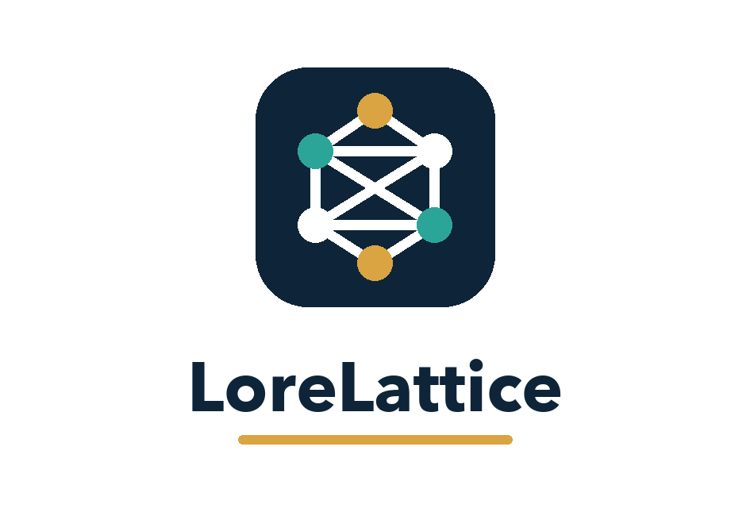
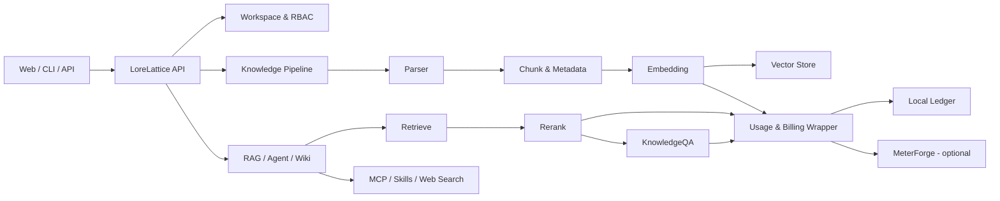

<p align="center">
  
</p>

<h1 align="center">LoreLattice</h1>

<p align="center">
  把文档、模型调用与 Agent 工作流放进一个可检索、可追踪、可自托管的知识空间。
</p>

<p align="center">
  <a href="https://github.com/Pototoooo/LoreLattice/actions"></a>
  <a href="./LICENSE"></a>
  
  
  
</p>

## 项目定位

LoreLattice 是一个面向个人与团队知识工作的自托管 AI 平台。它不是单独的聊天壳，也不是只负责向量检索的组件，而是把下面四条链路放在同一个工作空间内：

1. **知识加工**：文件上传、解析、切块、向量化、图谱抽取与问题生成。
2. **知识使用**：RAG 快速问答、引用回溯、全局搜索和自动 Wiki。
3. **Agent 执行**：ReAct 推理、知识库检索、Web Search、MCP 与 Skills。
4. **模型治理**：五类模型配置、BYOK、统一 AI Credits、调用明细与本地账本。

适合以下场景：

- 为研究资料、产品文档或团队规范建立可追溯问答入口；
- 从大量原始文档生成互相链接的 Wiki 页面和关系图；
- 让 Agent 在明确的知识库、工具和权限范围内完成多步骤任务；
- 对 Chat、Embedding、Rerank、VLM、ASR 的使用量做统一观察；
- 在本地或私有网络中替换模型、向量库、解析器与对象存储。

## 五类模型分别做什么

LoreLattice 把模型按职责拆开配置，而不是要求一个模型完成所有事情。

| 配置项 | 主要职责 | 典型调用时机 |
|---|---|---|
| KnowledgeQA | 对话生成、RAG 答案、Agent 推理、Wiki 内容生成 | 提问、Agent 执行、Wiki 后处理 |
| Embedding | 把文档块和查询转换为向量 | 文档入库、语义检索 |
| Rerank | 对初步召回结果重新排序 | 生成答案前筛选上下文 |
| VLLM | 理解图片、扫描页与图表 | 多模态解析、图片问答 |
| ASR | 把音频转换为文本 | 音频文件解析 |

如果模型平台同时提供这五类 API，同一个 API Key 可以复用；但每个职责仍需在模型管理页分别建立配置。只做纯文本文档问答时，可以先配置 KnowledgeQA、Embedding 和 Rerank，再按需要补充 VLLM、ASR。

## 核心调用链



知识库回答不是“模型直接阅读全部文件”。系统先检索候选内容，再由 Rerank 选择更相关的上下文，最后交给 KnowledgeQA 生成带来源的答案。Wiki 模式则在文档解析完成后继续生成结构化页面、目录和页面引用图。

## 快速启动

### 1. 准备环境

- Docker Desktop 或 Docker Engine + Compose
- Git
- 至少一组可用模型配置；首次启动本身不要求提前填写模型 Key

### 2. 克隆与创建本地配置

```bash
git clone https://github.com/Pototoooo/LoreLattice.git
cd LoreLattice
cp .env.example .env
```

首次启动前至少修改 `.env` 中的数据库密码、Redis 密码、`JWT_SECRET` 和 `SYSTEM_AES_KEY`。其中 `SYSTEM_AES_KEY` 必须是 32 字节，并且丢失后无法解密数据库里保存的模型凭证。

可用下面的命令生成本地随机值：

```bash
openssl rand -hex 32   # JWT_SECRET
openssl rand -hex 16   # SYSTEM_AES_KEY: 32 个 ASCII 字符
```

不要提交 `.env`。仓库只保留带注释的 `.env.example`。

### 3. 启动核心服务

```bash
docker compose up -d
```

核心服务包括：

- `frontend`：Web UI，默认端口 `80`
- `app`：Go API 与后台任务，默认端口 `8080`
- `docreader`：文档解析服务
- `postgres`：业务数据与 pgvector
- `redis`：流式消息与异步任务队列

### 4. 验证

```bash
docker compose ps
curl http://localhost:8080/health
```

健康接口返回 `{"status":"ok"}` 后，打开 [http://localhost](http://localhost)，创建账户并进入设置页配置模型。

## 推荐的首次使用顺序

1. 在 **设置 → 模型管理** 中配置 KnowledgeQA、Embedding、Rerank。
2. 新建一个普通文档知识库，上传一份 Markdown 或 PDF。
3. 等待解析完成，在快速问答中验证答案和引用来源。
4. 新建 Wiki 知识库，观察“文档 → 页面 → 页面引用图”的生成过程。
5. 打开智能体，为它限定知识库和工具，再进行多步骤问题测试。
6. 在 **套餐与用量** 中检查 BYOK 调用是否被记录为“不扣费”。

## AI Credits 与 BYOK

LoreLattice 将模型调用分为四种计费语义：

| 模式 | 含义 | 是否消耗平台额度 |
|---|---|---:|
| `platform` | 平台提供并承担成本的模型 | 是 |
| `included` | 套餐中包含的模型调用 | 是 |
| `byok` | 用户提供 API Key | 否 |
| `local` | Ollama 等本地模型 | 否 |

BYOK 和本地模型仍会记录调用次数与 Token，便于分析使用量，但不会从 AI Credits 重复扣费。MeterForge 是可选的外部计量/订阅组件；远端计费暂时不可用时，页面会回退到本地账本，平台代付调用则保持 fail-closed。

## 可替换组件

- **模型平台**：OpenAI-compatible API、SiliconFlow、Qwen、DeepSeek、智谱、Ollama 等。
- **向量检索**：PostgreSQL/pgvector、Qdrant、Milvus、Weaviate、Elasticsearch、OpenSearch 等。
- **解析器**：内置 DocReader、OpenDataLoader、PaddleOCR-VL 等。
- **存储**：Local、MinIO、S3、COS、OSS、TOS、OBS、KS3。
- **工具与渠道**：MCP、Agent Skills、Web Search、网页嵌入与多种 IM 渠道。

可选组件通过 Compose profile 或设置页启用，不建议第一次运行时一次性启动全部服务。

## 开发与验证

```bash
# 基础依赖
make dev-start

# 后端热更新
make dev-app

# 前端开发服务器
make dev-frontend
```

常用检查：

```bash
go test ./internal/application/service ./internal/billing ./internal/models/chat
cd frontend
npm ci
npm run test
npm run type-check
npm run build
```

前端构建要求 Node.js 20.19+，项目验证环境使用 Node.js 24。

## 文档入口

- [内置模型配置](./docs/BUILTIN_MODELS.md)
- [开发指南](./docs/开发指南.md)
- [常见问题](./docs/QA.md)
- [知识图谱](./docs/KnowledgeGraph.md)
- [Agent Skills](./docs/agent-skills.md)
- [MCP 使用说明](./docs/MCP功能使用说明.md)
- [Lite 单机模式](./docs/LITE.md)
- [上游来源与许可边界](./UPSTREAM.md)
- [LoreLattice 的差异与验证证据](./PROJECT_DIFF.md)

## 安全提示

- 不要提交模型 Key、`.env`、数据库导出或容器 inspect 文件。
- 公开部署前必须更换示例密码和加密密钥，并关闭公开注册或配置邀请策略。
- `SYSTEM_AES_KEY` 应进入密码管理器；不要在实例运行后随意更换。
- Agent Skills 和 MCP 工具应遵循最小权限，并为高风险工具保留人工审批。
- 漏洞报告方式见 [SECURITY.md](./SECURITY.md)。

## 项目来源

LoreLattice 基于 [Tencent/WeKnora](https://github.com/Tencent/WeKnora) 的开源代码继续演进，不是腾讯官方发行版。仓库保留来源、许可证和历史可追溯性；本项目重点改造及不能归为个人贡献的边界见 [UPSTREAM.md](./UPSTREAM.md) 与 [PROJECT_DIFF.md](./PROJECT_DIFF.md)。

## License

本项目沿用上游许可要求，主体代码采用 MIT License；部分第三方组件适用其各自许可证。完整文本见 [LICENSE](./LICENSE)。
