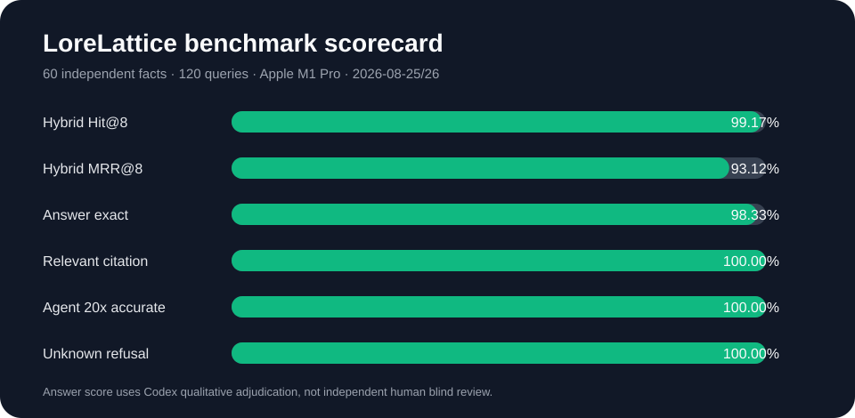

# LoreLattice 可复现测试与 Benchmark 报告

> 执行时间：2026-08-25 至 2026-08-26  
> 基线 commit：`f0eca422ed78f396d3f9a8c5dd26d0bf100028a7`  
> 测试分支：`newBee/benchmark-evidence`  
> 机器：Apple M1 Pro，8 logical CPU，16 GiB RAM，macOS 26.5.2 arm64

## 1. 结论先行

Benchmark 可以用于简历，但必须把 **数据集、质量、稳定性、性能** 分开描述。
本轮得到的可复现结论是：

1. **回归基线通过**：Go 全仓 87 个 package 结果通过（66 个含测试、21 个无测试），
   前端 225/225 测试通过且 type-check/build 成功，DocReader 111 项通过（6 skipped），
   CLI race/vet/build 通过，语句覆盖率 69.3%。
2. **检索质量高但数据集偏词法**：120 条查询的 Hybrid Hit@8 为 99.17%、
   MRR@8 为 93.13%；keyword-only Hit@8 为 100%、MRR@8 为 93.16%，说明这套
   精确企业术语语料偏向关键词检索，不能写成“Hybrid 普遍优于关键词”。
3. **稳定条件下回答质量可用**：冷却与受控重试后的 120 条最终集，Codex 逐答
   审定 118 条完全通过、2 条部分通过，完全通过率 98.33%；120/120 含相关引用，
   115/120 覆盖数据集声明的全部来源。
4. **并发稳定性是当前短板**：首轮 4 workers 的 120 条 KnowledgeQA 中，后 55 条
   出现固定拒答或 EOF；其中仅前 65 条可直接进入质量集。受控单路重试恢复，说明
   这是突发并发/上游保护问题，不能把恢复后的质量分冒充 4 并发成绩。
5. **Agent 重复回答修复有效，但超时约束未闭环**：同一事实问题顺序运行 20 次，
   20/20 都含正确事实且最终段落无重复；5/5 个不存在问题均明确“未找到”。不过
   25 次中出现 1 次 128.6 秒长尾，超过治理文档的 90 秒目标。
6. **本地只读 API 在受控 300 RPS 下无 HTTP 失败**：10/100/300 target RPS
   三阶段完成 6,134 次 200 响应，18 次调度丢弃，P95 6.42 ms；不设速率的 50 VU
   压测触发本机代理到上游的临时端口耗尽并产生 23,839 次 502，因此只作为
   stress-to-failure 证据，不作为服务容量结论。

## 2. 被测对象与模型

| 层 | 版本/配置 |
|---|---|
| 源码 | `f0eca422...`，分支 `newBee/benchmark-evidence` |
| App image | `sha256:8bc652f3780f...` |
| Frontend image | `sha256:b26d563e6faf...` |
| DocReader image | `sha256:dc0b22e276c1...` |
| Embedding | `text-embedding-v4`，1024 维，远程 |
| KnowledgeQA | `qwen3.7-plus`，远程 |
| Rerank | 未启用 |
| 数据集 | 12 份合成企业制度文档，60 个独立事实，120 条问法 |

源码 commit 与已部署 image 通过两套标识分别冻结；未证明 image 必然由该 commit
构建，因此报告不把两者写成同一个版本证据。

## 3. 数据集设计

- 12 份文档覆盖公司治理、产品路线图、客户合同、报价、交付、事故、权限、预算、
  人员、AI 治理和经营决议。
- 60 个独立事实，每个事实提供 canonical 与 paraphrase 两种问法，共 120 条。
- 96 条单文档题，24 条多文档题。
- 每条都冻结 `expected_answer`、`source_docs` 与 `evidence_terms`；校验器确认
  120/120 的证据词能在声明源文档中找到。
- 文档均为测试合成数据，不是生产客户数据。

## 4. 回归测试

| 范围 | 结果 | 时间 | 备注 |
|---|---:|---:|---|
| Go 全仓 | 87 packages，suite exit 0 | 82.67 s | 临时 DocReader 代理；安全负例未放宽 |
| Frontend | 225 pass / 0 fail | 163.94 s | test + type-check + production build |
| DocReader | 111 run，6 skipped，0 fail | 21.12 s | 3 个缺失 fixture 由确定性脚本生成 |
| CLI | race + vet + build exit 0 | 88.83 s | statement coverage 69.3% |

首次失败日志被保留。修正的是测试夹具、环境污染和本机到容器的连接条件，不是删除
安全断言或跳过业务测试。完整过程见 `DECISION_LOG.md`。

## 5. 检索 Benchmark

固定 Top-K=8、workers=4；每种检索模式各 120 次，共 360 次请求，360/360 成功。

| 模式 | Hit@1 | Hit@8 | MRR@8 | Source Recall@8 | P50 | P95 |
|---|---:|---:|---:|---:|---:|---:|
| Hybrid | 88.33% | 99.17% | 93.13% | 98.33% | 406.64 ms | 653.16 ms |
| Vector | 85.00% | 99.17% | 90.72% | 97.50% | 238.08 ms | 407.24 ms |
| Keyword | 89.17% | 100.00% | 93.16% | 98.75% | 127.70 ms | 147.71 ms |

### 解释

- 数据集大量包含产品代号、日期、比例和制度术语，天然有利于词法匹配。
- Rerank 未启用，因此这不是“完整五模型链路”的对比。
- 合理的工程决策是对精确术语查询保留 keyword 通道，并用更自然、更噪声化的
  用户问题集再决定是否增加 rerank，而不是先增加模型成本。

## 6. KnowledgeQA 质量与稳定性

### 6.1 首轮并发稳定性探针

| 项 | 结果 |
|---|---:|
| 查询 | 120 |
| workers | 4 |
| 可直接进入最终质量集 | 65 |
| 固定拒答或 EOF 后需重试 | 55（45.83%） |
| 进程级成功 | 118/120 |
| 最大延迟 | 110.64 s |

### 6.2 受控最终质量集

最终集选择：首轮正常 65 条 + workers=1 重试成功 54 条 + 最后一条单次重试 1 条。

| 指标 | 结果 |
|---|---:|
| Codex 逐答完全通过 | 118/120（98.33%） |
| 完全或部分通过 | 120/120 |
| 有引用 | 120/120 |
| 至少一个相关来源引用 | 120/120 |
| 覆盖全部声明来源 | 115/120（95.83%） |

两个部分通过样本：

1. `EKV1-029-P`：核心 L2/L3 事实正确，但附带不存在的 `example.com` 占位图片。
2. `EKV1-057-P`：正确说明经营决议优先并提到转拨 20 万元，但未给出冻结预期中的
   总额 180 万元及调整后的 52/50 万元。

审定者是 Codex，不是独立人工盲审；因此简历应写“基于冻结答案逐条审定”，不要写
“人工专家准确率”。混合了重试路径的最终集不用于延迟结论；单路 55 条重试中，
54 条成功，成功条目的 P50/P95 为 6.24/9.61 秒。

## 7. Agent 行为测试

被测对象：`builtin-smart-reasoning`。

| 指标 | 结果 |
|---|---:|
| 总运行 | 25 |
| 同一事实题正确事实出现 | 20/20 |
| 同一事实题最终段落无重复 | 20/20 |
| 不存在问题明确拒答 | 5/5 |
| 工具调用 | 79 |
| 投影流中返回 tool_result | 77/79（97.47%） |
| 已返回 tool_result 无错误 | 77/77 |
| 单次最多工具调用 | 11 |
| P50 / P95 | 8.44 s / 41.47 s |
| 最大延迟 | 128.64 s |

两个 `get_document_info` 调用没有出现在 CLI 投影的 tool_result 中，但 Agent 均继续
生成了有依据的“未找到”结论；这应继续追查为事件流完整性问题。运行时配置是
`max_iterations=50`、`llm_call_timeout=120`，与治理文档中的“最多 12 次工具、
90 秒”不是同一门控；128.6 秒长尾证明需要把文档目标落实为服务端总截止时间。

## 8. 性能与资源

### 8.1 受控只读 API

本机通过 Nginx 访问已鉴权的 `GET /api/v1/knowledge-bases`：

- 10、100、300 target RPS 各 15 秒；完成 6,134 次，均为 HTTP 200。
- k6 调度丢弃 18 次，完成占已完成+丢弃的 99.71%。
- 延迟 P50 2.46 ms、P95 6.42 ms、max 175.94 ms。
- 采样峰值：App 43.34% CPU / 234.5 MiB；Frontend 5.89% / 9.77 MiB；
  Postgres 16.15% / 91.93 MiB；Redis 1.33% / 21.39 MiB。

### 8.2 Stress-to-failure

不加 sleep 的 1/10/50 VU 本机压力产生 52,070 次请求，其中 23,839 次 502。
Nginx 日志字面错误是 `connect() ... failed (99: Address not available)`，即本机代理
连接上游时临时端口/地址资源耗尽。它证明当前部署缺少足够的连接复用/压力保护，
但不能等价为“服务只能承受某个 RPS”。

### 8.3 Frontend 静态 shell

1/10/50 VU 本机无节流请求 `/`：255,524 次、0 失败，P95 5.09 ms。这里只测 Nginx
返回 HTML shell，不代表浏览器渲染、交互或端到端用户旅程性能。

## 9. 可写入简历的表述

优先采用 `RESUME_BULLETS.md` 中的保守版本。任何数字旁至少保留以下限定：

- 12 份合成文档、60 个独立事实、120 条查询；
- Apple M1 Pro 本机 Docker；
- `qwen3.7-plus` + `text-embedding-v4`，rerank 未启用；
- 回答准确率为 Codex 逐答审定，不是专家盲测；
- 300 RPS 是只读列表 API，不是 LLM 问答吞吐。

## 10. 下一轮优先级

1. 对 KnowledgeQA 增加请求队列、429/EOF 分类和指数退避；用 1/2/4 workers
   固定阶梯重新测成功率与 P95。
2. 将 Agent 总截止时间放在服务端，而不是只配置单次 LLM timeout；补齐 tool_call
   与 tool_result 的事件配对测试。
3. 新增至少 200 条自然用户问题，包含错别字、口语、省略、负样本和权限题，并由
   独立人工双人复核；再比较 hybrid、keyword 与 rerank。
4. 前端用真实浏览器增加登录、知识库、Agent、设置、上传与问答主路径 E2E；当前
   225 项单测和静态 shell 压测不能替代 E2E。

## 11. 证据索引

- 决策日志：`DECISION_LOG.md`
- 指标表：`METRICS.csv`
- 原始检索：`../../results/2026-08-25/retrieval/retrieval_raw.jsonl`
- 最终回答：`../../results/2026-08-25/answer/final/answer_final.jsonl`
- 逐答审定：`../../results/2026-08-25/answer/ANSWER_ADJUDICATION.csv`
- Agent 原始事件：`../../results/2026-08-25/agent/agent_raw.jsonl`
- k6 与资源：`../../results/2026-08-25/performance/`
- 回归日志：`../../results/2026-08-25/regression/`

