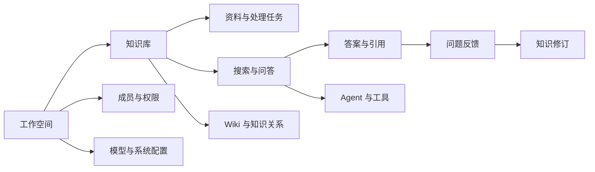
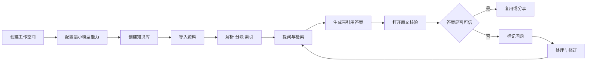

# LoreLattice 产品立项 PRD（全产品｜面试展示版）

> 文档版本：1.0  
> 文档日期：2026-08-20  
> 文档阶段：立项评审 / MVP 开发前  
> 决策对象：是否投入资源建设 LoreLattice，以及首个版本建设什么  
> 产品形态：自托管 AI 知识工作平台  
> 文档负责人：产品经理  

---

## 0. 文档声明：这是一份立项 PRD

本 PRD 用于产品启动前统一问题、目标、范围、优先级、验收和投入决策，不以已经完成的功能倒推需求。

因此，全文遵循四条规则：

1. 用户痛点、目标用户、使用频率和付费意愿均属于**待验证假设**；
2. 指标中的数字均是**立项目标或决策阈值**，不是已经取得的业务结果；
3. 技术方案只描述能力边界和约束，不替研发预先锁死实现；
4. 立项通过不等于直接开发全部功能，必须先完成问题访谈和原型验证门槛。

### 0.1 本次立项需要回答的六个问题

| 决策问题 | 本 PRD 的回答 |
|---|---|
| 为谁做 | 首批聚焦 20–500 人知识密集型团队中的知识负责人、知识使用者与平台管理员 |
| 解决什么 | 让团队在分散、变化且有权限边界的资料中，更快完成有来源、可复核的知识任务 |
| 为什么现在做 | 大模型降低了知识理解成本，但企业仍缺少把资料、检索、引用、权限与持续维护连成闭环的轻量产品 |
| 首版做什么 | 工作空间、资料导入、知识加工、带引用问答、来源核验、问题反馈、基础治理与评估 |
| 首版不做什么 | 通用低代码工作流、全行业模板市场、自研基础模型、复杂计费、移动端原生应用 |
| 如何判断值得继续 | 用户能在 30 分钟内完成首个可信知识任务，并在试用期内产生可复用、可核验的持续使用 |

---

## 1. 立项摘要

### 1.1 产品一句话

> **LoreLattice 是面向知识密集型团队的自托管 AI 知识工作平台，把分散资料转化为可检索、可推理、可追溯、可持续维护的团队知识资产。**

### 1.2 核心问题

团队拥有大量文档并不代表能够有效使用知识。当前流程通常断裂在四个环节：

1. **资料分散**：信息存在文件夹、网盘、协作平台、FAQ 和个人空间；
2. **答案不可信**：搜索只能返回文件，大模型回答又可能缺少可靠出处；
3. **知识不维护**：错误、过期和冲突资料无法进入统一的修订闭环；
4. **部署与治理成本高**：模型、解析、向量检索、权限和数据边界需要多套系统拼接。

### 1.3 产品机会

市场中已有企业搜索、通用大模型文件问答、RAG 工具和 AI 应用开发平台。LoreLattice 不以“能力最多”为立项目标，而聚焦一条差异化主线：

> **从资料进入系统，到用户得到带来源的答案，再到问题被标记和知识被修订，形成可信知识闭环。**

### 1.4 立项建议

**建议有条件立项。**

立项条件不是直接进入大规模研发，而是：

- 先完成 5–8 名目标用户的问题访谈；
- 至少 3 名用户确认“跨文档查证 + 来源核验”是近期重复发生的任务；
- 至少 3 名用户愿意提供脱敏资料参与原型测试；
- 可点击原型的核心任务成功率达到 70% 以上；
- 研发完成文档解析、检索、权限和部署路径的技术 Spike，无阻断性风险。

如上述条件不满足，应调整场景或停止投入，而不是通过扩大功能范围掩盖需求不足。

---

## 2. 背景与立项依据

### 2.1 问题背景

知识密集型团队每天都在进行“查资料—判断—引用—交付—更新”的工作。随着文档数量、成员数量和业务变化速度提升，传统文件管理逐渐暴露出三个结构性缺口：

- 文件系统擅长保存，但不擅长跨文档理解；
- 通用搜索擅长召回，但不负责组织结论；
- 通用大模型擅长生成，但不了解组织最新资料和权限边界。

产品机会不在增加一个聊天入口，而在于把知识使用过程组织成可观察、可验证、可维护的产品闭环。

### 2.2 待验证问题假设

| 编号 | 假设 | 需要的证据 | 否定条件 |
|---|---|---|---|
| H1 | 目标团队每周发生多次跨文档查证 | 访谈中的近期真实事件、任务日志 | 多数用户每月不足一次，且单文档搜索已足够 |
| H2 | 用户愿意为来源可追溯牺牲少量回答速度 | 原型对比测试、行为选择 | 用户持续忽略引用，只关注生成速度 |
| H3 | 知识负责人愿意维护问题与修订队列 | 一周试用中的处理行为 | 反馈长期无人处理，维护责任无法成立 |
| H4 | 私有化或模型可控是部分团队的采购条件 | 管理员与决策者访谈 | 用户均接受通用 SaaS，部署控制不是决策因素 |
| H5 | 30 分钟内获得首个可信答案能够促进激活 | 首次任务计时与完成率 | 配置成本显著高于用户预期且无法模板化 |

### 2.3 替代方案

| 替代方案 | 当前优势 | 用户仍需承担的成本 |
|---|---|---|
| 文件夹、网盘、企业搜索 | 使用习惯成熟，权限体系已有 | 需要人工打开多份资料并拼接结论 |
| 通用大模型上传文件 | 上手快，适合一次性总结 | 资料同步、权限、持续维护和长期复用不足 |
| AI 应用开发平台 | Workflow、Agent、模型与工具生态丰富 | 用户先要“搭应用”，知识可信维护不是唯一主线 |
| 单点 RAG 问答 | 文档问答路径直接 | 容易停留在问答层，问题反馈与知识更新断裂 |
| 自研检索与 Agent | 高度定制、可嵌入业务 | 建设、评估、运维和迭代成本高 |

### 2.4 竞争定位假设

Dify、FastGPT 与 MaxKB 均覆盖知识库、工作流或 Agent 等能力，说明“AI 应用搭建平台”已经形成明确品类。LoreLattice 的立项边界不是复制通用编排平台，而是优先做深：

1. 原始资料到结构化知识的加工过程；
2. 回答到原文证据的核验路径；
3. 错误发现到知识修订的维护闭环；
4. 自托管环境中的权限、模型与数据可控。

### 2.5 为什么值得探索

- 问题具有高频、跨角色和长期存在的可能性；
- RAG、引用、文档解析和权限技术已有成熟基础，可用有限投入验证；
- 产品可以从单一部门的小团队试用开始，不依赖全公司一次性迁移；
- 如果“可信知识闭环”不成立，也能通过早期门槛及时停止，控制沉没成本。

---

## 3. 产品愿景、目标与非目标

### 3.1 产品愿景

让每个团队都能把分散资料变成可查证、可维护、可持续演进的知识系统。

### 3.2 三阶段目标

| 阶段 | 时间假设 | 产品目标 | 决策结果 |
|---|---:|---|---|
| Discovery | 2 周 | 验证问题、角色、频率、现有替代方案与使用意愿 | Go / Pivot / Stop |
| MVP | 8–10 周 | 跑通“导入—加工—问答—引用—反馈”最小可信闭环 | 是否进入小规模试用 |
| Pilot | 4 周 | 验证首次价值、任务成功率、知识维护和周度复用 | 是否进入 V1 与扩展场景 |

### 3.3 产品目标

#### G1：降低首次可信知识任务成本

新工作空间应能在 30 分钟内完成模型配置、资料导入并获得第一个可核验答案。

#### G2：让答案能够回到证据

所有基于知识库生成的事实性回答都应提供可打开的引用，用户能够查看对应原文与文档信息。

#### G3：让错误进入维护闭环

用户发现回答问题后，可以标记原因并交给知识负责人处理，处理结果可追踪。

#### G4：满足团队使用的基础治理

产品应具备工作空间、成员角色、资源权限、审计记录以及自托管部署能力。

### 3.4 非目标

首个版本明确不解决：

- 面向所有行业的通用 AI 应用开发；
- 自研通用大模型、Embedding 或 Rerank 基础模型；
- 完整 BPM/低代码流程编排；
- CRM、工单、项目管理等业务系统替代；
- 企业级复杂审批、合同和商业计费；
- 原生 iOS/Android 客户端；
- 无人监督的高风险自动决策。

---

## 4. 目标市场与用户

### 4.1 首要 ICP（待验证）

> **拥有持续增长的内部资料、每周发生跨文档查证、对答案来源或数据边界有要求，但缺少专职知识工程团队的 20–500 人知识密集型组织。**

| 维度 | 首要范围 |
|---|---|
| 企业类型 | 科技公司、研发团队、专业服务组织、知识密集型中小企业 |
| 首要部门 | 产品研发、解决方案、客户支持、内部运营 |
| 组织规模 | 20–500 人；首批试点以 5–30 人单部门为单位 |
| 资料状态 | 已有 100–10,000 份文档，来源分散并持续变化 |
| 技术条件 | 可以使用云端或本地模型；能够接受 Docker 自托管 |
| 购买触发 | 重复答疑增加、知识交接困难、错误答案风险提升、资料迁移或系统升级 |

### 4.2 核心角色

#### Persona A：知识负责人

- 典型身份：产品负责人、技术文档负责人、客服知识运营；
- 核心任务：组织资料、维护知识质量、处理问题反馈；
- 主要痛点：资料多且分散、过期内容难识别、重复答疑；
- 成功标准：能够看到知识处理状态、回答问题和待修订内容。

#### Persona B：知识使用者

- 典型身份：产品、研发、售前、交付、客服或新成员；
- 核心任务：快速查证事实、理解资料并带出处交付；
- 主要痛点：不知道正确资料在哪里，也不敢直接采用无来源回答；
- 成功标准：在一个入口得到答案、打开引用、确认原文并继续追问。

#### Persona C：平台管理员

- 典型身份：IT、研发负责人、AI 平台工程师；
- 核心任务：部署、配置模型、管理成员、控制数据和排查故障；
- 主要痛点：AI 知识应用组件多、权限分散、调用不可观察；
- 成功标准：可控地部署、切换模型、查看运行状态和审计记录。

### 4.3 暂不优先的用户

- 只需要临时上传一份文件并总结的个人用户；
- 没有持续资料、没有复用需求的团队；
- 需要完整低代码应用编排而非知识工作的开发团队；
- 第一阶段即要求超大规模、多地域容灾和复杂组织审批的客户。

---

## 5. 核心场景与 JTBD

### 5.1 核心 Job to be Done

> 当我需要基于团队分散资料完成判断或交付时，我希望快速获得一份带来源、能核验的答案，并在发现问题时推动知识被修正，从而减少重复查找和错误传播。

### 5.2 场景优先级

| 场景 | 频率假设 | 痛点强度 | 产品匹配 | 优先级 |
|---|---:|---:|---:|---:|
| 跨文档事实查证与引用 | 高 | 高 | 高 | P0 |
| 产品、制度、技术资料问答 | 高 | 高 | 高 | P0 |
| 新成员知识自助与交接 | 中 | 高 | 高 | P0 |
| 回答问题反馈与知识修订 | 中 | 高 | 高 | P0 |
| 从资料自动生成 Wiki 导航 | 中 | 中 | 高 | P1 |
| 多步骤研究与工具调用 | 中 | 中 | 中 | P1 |
| 外部数据源持续同步 | 中 | 高 | 中 | P1 |
| 通用业务流程编排 | 未知 | 中 | 低 | P2 / 暂缓 |

### 5.3 用户故事

| ID | 角色 | 用户故事 | 优先级 |
|---|---|---|---:|
| US-01 | 知识负责人 | 我想创建一个独立知识空间并导入资料，以便团队从统一来源开始使用 | P0 |
| US-02 | 知识负责人 | 我想看到每份资料的处理进度和失败原因，以便及时修复 | P0 |
| US-03 | 知识使用者 | 我想用自然语言提问并获得带引用答案，以便快速完成查证 | P0 |
| US-04 | 知识使用者 | 我想打开引用定位到原文，以便确认答案没有曲解资料 | P0 |
| US-05 | 知识使用者 | 我想标记答案错误、过期或证据不足，以便知识负责人处理 | P0 |
| US-06 | 知识负责人 | 我想查看问题队列并记录处理结果，以便知识持续改进 | P0 |
| US-07 | 平台管理员 | 我想配置模型与数据处理组件，以便在可控环境运行产品 | P0 |
| US-08 | 平台管理员 | 我想为成员设置角色和资源权限，以便控制读写与管理操作 | P0 |
| US-09 | 知识负责人 | 我想从原始资料生成 Wiki 目录和关联页面，以便形成知识导航 | P1 |
| US-10 | 高级使用者 | 我想让 Agent 在指定知识库和工具范围内完成研究任务 | P1 |

---

## 6. 产品原则

1. **证据优先于生成**：事实性答案必须能够回到原文；证据不足时明确表达不确定性。
2. **先成功，再高级**：默认配置应覆盖首个任务，高级检索参数渐进披露。
3. **知识进入闭环**：产品价值不能止于回答，问题应进入反馈、处理和修订。
4. **权限默认收紧**：用户只访问被授权的空间和资源，管理操作可审计。
5. **模型与基础设施可替换**：产品不应绑定单一模型或云服务。
6. **可观测而非黑盒**：处理失败、检索来源、回答引用和关键操作应可解释。
7. **用任务价值控制范围**：不因竞品拥有某功能就自动进入首版。

---

## 7. 产品信息架构

### 7.1 一级导航建议

| 导航 | 核心对象 | 首版状态 |
|---|---|---|
| 首页 | 首次任务引导、近期知识库、待处理问题 | P0 |
| 知识库 | 资料、处理状态、检索设置、成员权限 | P0 |
| 问答 | 对话、知识范围、引用、反馈 | P0 |
| 问题中心 | 错误、过期、证据不足与处理记录 | P0 |
| Wiki | 目录、页面、关系与修订 | P1 |
| Agent | 预置 Agent、自定义工具范围和运行记录 | P1 |
| 管理 | 成员、角色、模型、审计、系统状态 | P0 |

---

## 8. 核心产品闭环

### 8.1 首次价值路径

1. 管理员创建或进入工作空间；
2. 产品检查最小模型配置，并提供模板或明确缺项；
3. 知识负责人创建知识库并上传 1–5 份测试资料；
4. 系统展示解析、分块和索引进度；
5. 用户使用示例问题或自行提问；
6. 系统返回带引用的回答；
7. 用户打开引用确认原文；
8. 产品记录“首个可信知识任务完成”。

### 8.2 高频复用路径

1. 用户进入最近使用的知识库或问答入口；
2. 选择或自动继承知识范围；
3. 提问、查看引用并继续追问；
4. 对不可信回答标记问题；
5. 知识负责人处理问题并更新资料；
6. 后续用户获得更新后的答案。

---

## 9. MVP 范围与版本策略

### 9.1 MVP 定义

MVP 不是“功能最少的知识库”，而是能够验证以下价值命题的最小完整产品：

> 用户能否在可接受的配置成本下，把自己的资料变成可问答、可追溯、可反馈的团队知识空间，并愿意在一周内重复使用。

### 9.2 MoSCoW 范围

#### Must have（MVP 必须）

- 工作空间与基本成员角色；
- 最小模型配置和可用性检查；
- 创建知识库、上传资料、查看处理状态；
- 文档解析、分块、索引与失败重试；
- 自然语言问答、知识范围选择和多轮上下文；
- 答案引用、原文预览和文档定位；
- 答案反馈、问题分类和处理状态；
- 基础检索测试与质量样例集；
- 审计日志、健康状态和自托管部署说明。

#### Should have（Pilot 前完成）

- Wiki 目录与页面生成；
- FAQ 优先回答；
- 外部数据源手动同步；
- 预置研究 Agent；
- 团队共享与细粒度资源权限；
- 管理员可查看模型调用和失败记录。

#### Could have（验证后决定）

- Web Search、MCP 与 Skills；
- IM 机器人与开放 API；
- 多向量库和多对象存储适配；
- 知识图谱可视化；
- 自动定时同步与通知；
- 模板中心。

#### Won't have now（当前不做）

- 通用可视化 Workflow 编排器；
- 自研基础模型训练平台；
- 复杂商业计费和经销商体系；
- 移动端原生应用；
- 跨地域多活与超大企业定制审批。

### 9.3 范围控制原则

任何新增需求进入 MVP 前必须回答：

1. 是否直接缩短首次可信知识任务时间？
2. 是否提升来源核验或问题修订完成率？
3. 是否是团队试用不可缺少的治理能力？

三个问题均为“否”的需求不得进入 MVP。

---

## 10. 功能需求

### 10.1 工作空间与首次引导

| ID | 需求 | 优先级 | 验收标准 |
|---|---|---:|---|
| FR-001 | 用户可创建工作空间并设置名称 | P0 | 创建成功后进入首页；名称可修改；失败有明确原因 |
| FR-002 | 首次进入展示四步引导：模型、知识库、资料、提问 | P0 | 每一步显示完成状态；可跳过非阻断步骤 |
| FR-003 | 系统自动检查最小运行条件 | P0 | 明确区分已配置、缺失和连接失败，不暴露密钥 |
| FR-004 | 首页展示首个任务入口和最近对象 | P0 | 新用户看到下一步；老用户看到最近知识库和待处理问题 |

### 10.2 模型与基础能力配置

| ID | 需求 | 优先级 | 验收标准 |
|---|---|---:|---|
| FR-010 | 管理员可配置对话模型与 Embedding | P0 | 保存前连接测试；密钥脱敏；配置失败不影响已有配置 |
| FR-011 | 管理员可选配 Rerank、视觉理解和语音识别 | P1 | 未配置时相关能力隐藏或提示，不阻断纯文本路径 |
| FR-012 | 系统提供推荐默认值和职责说明 | P0 | 非技术用户能区分生成、向量化与重排职责 |
| FR-013 | 管理员可停用或切换模型配置 | P1 | 切换有影响提示；正在处理任务保持状态一致 |

### 10.3 知识库与资料导入

| ID | 需求 | 优先级 | 验收标准 |
|---|---|---:|---|
| FR-020 | 用户可创建知识库并填写名称、描述和可见范围 | P0 | 必填校验完整；默认权限最小化 |
| FR-021 | 用户可批量上传常见文档 | P0 | 支持 PDF、DOCX、Markdown、TXT；单文件失败不影响其他文件 |
| FR-022 | 系统展示上传、解析、分块、索引状态 | P0 | 状态可刷新；失败显示阶段、原因和建议动作 |
| FR-023 | 用户可重试失败任务或删除资料 | P0 | 重试不重复创建有效数据；删除有二次确认 |
| FR-024 | 用户可预览文档与分块结果 | P0 | 可查看原文、分块文本和基础元数据 |
| FR-025 | 用户可选择默认或高级分块策略 | P1 | 默认值能直接使用；高级参数包含说明和范围校验 |
| FR-026 | 用户可通过外部数据源导入资料 | P1 | 显示来源、同步时间、成功与失败条目 |

### 10.4 检索、问答与引用

| ID | 需求 | 优先级 | 验收标准 |
|---|---|---:|---|
| FR-030 | 用户可选择知识库并用自然语言提问 | P0 | 无知识库时阻止发送并提示创建或选择 |
| FR-031 | 系统检索相关资料并生成回答 | P0 | 回答失败时保留问题并支持重试；不展示系统内部秘密 |
| FR-032 | 事实性回答展示引用列表 | P0 | 引用包含文档名、相关片段和可打开入口 |
| FR-033 | 用户可从回答跳转原文上下文 | P0 | 默认展示命中片段前后文；可返回原对话位置 |
| FR-034 | 证据不足时系统明确表达不确定性 | P0 | 不生成伪引用；提供补充资料或调整范围建议 |
| FR-035 | 用户可继续追问并查看本轮使用的知识范围 | P0 | 多轮上下文可清除；每轮引用独立可追溯 |
| FR-036 | 用户可查看检索测试结果 | P1 | 输入查询后展示召回片段、分数和排序结果 |

### 10.5 问题反馈与知识修订

| ID | 需求 | 优先级 | 验收标准 |
|---|---|---:|---|
| FR-040 | 用户可对回答标记“错误、过期、证据不足、无关” | P0 | 反馈与回答、引用和知识库关联；可补充说明 |
| FR-041 | 知识负责人可查看问题列表 | P0 | 支持按知识库、类型、状态和时间筛选 |
| FR-042 | 负责人可认领、处理、关闭或重新打开问题 | P0 | 每次状态变化记录操作者、时间和备注 |
| FR-043 | 负责人可从问题跳转对应资料 | P0 | 能定位引用片段或相关文档；处理后可重新测试问题 |
| FR-044 | 系统保留问题处理历史 | P0 | 普通成员只看授权范围；管理员可审计 |

### 10.6 Wiki 与知识结构

| ID | 需求 | 优先级 | 验收标准 |
|---|---|---:|---|
| FR-050 | 用户可基于知识库生成 Wiki 目录 | P1 | 生成前展示范围和预估；失败可重试，不影响原始资料 |
| FR-051 | Wiki 页面保留来源引用 | P1 | 页面关键内容可回到原文，来源失效时提示 |
| FR-052 | 用户可编辑页面并查看修订记录 | P1 | 编辑权限受角色控制；历史版本可查看 |
| FR-053 | 页面之间可建立引用关系 | P1 | 关系可导航；删除页面前展示受影响关系 |

### 10.7 Agent 与工具

| ID | 需求 | 优先级 | 验收标准 |
|---|---|---:|---|
| FR-060 | 提供快速问答和研究两类预置模式 | P1 | 用户不配置 Prompt 即可使用；模式差异有说明 |
| FR-061 | Agent 只能访问被授权的知识库和工具 | P1 | 越权请求被拒绝并记录；默认工具范围最小化 |
| FR-062 | 用户可查看 Agent 的步骤状态和最终引用 | P1 | 不展示敏感内部推理；展示工具调用结果与失败原因 |
| FR-063 | 管理员可启停 Web Search、MCP 或 Skills | P2 | 变更立即生效；外部调用有域名和权限提示 |

### 10.8 成员、权限与审计

| ID | 需求 | 优先级 | 验收标准 |
|---|---|---:|---|
| FR-070 | 工作空间支持 Viewer、Contributor、Admin、Owner | P0 | 每个角色权限可查；每个空间只有一位 Owner |
| FR-071 | 用户只能访问授权资源 | P0 | 未授权读取和写入均被拒绝；前后端行为一致 |
| FR-072 | 管理员可邀请、移除和调整成员角色 | P0 | Owner 不被普通管理员降级；关键操作二次确认 |
| FR-073 | 系统记录关键管理和内容变更操作 | P0 | 日志包含操作者、动作、对象、时间和结果 |
| FR-074 | API 调用遵循空间和资源边界 | P1 | API Key 可撤销；错误不泄漏其他空间信息 |

### 10.9 系统状态与运维

| ID | 需求 | 优先级 | 验收标准 |
|---|---|---:|---|
| FR-080 | 产品提供核心服务健康状态 | P0 | 管理员可区分 API、解析、数据库与缓存异常 |
| FR-081 | 后台任务具备重试、超时和幂等保护 | P0 | 重复提交不产生重复有效数据；失败可恢复 |
| FR-082 | 管理员可查看最近失败任务 | P0 | 能按模块定位失败原因，不输出密钥和完整敏感内容 |
| FR-083 | 提供 Docker 自托管和升级说明 | P0 | 全新环境可按文档启动；升级包含备份与回滚路径 |

---

## 11. 关键交互与状态设计

### 11.1 空状态

- 没有模型：解释最小配置并进入连接测试；
- 没有知识库：提供创建入口和示例结构；
- 没有资料：说明支持格式、示例资料和隐私边界；
- 没有问题记录：解释问题中心的用途，而非只显示空表格。

### 11.2 处理中状态

资料处理必须展示阶段，而不是统一显示“处理中”：

`等待 → 上传完成 → 解析 → 分块 → 向量化 → 建立索引 → 可用`

每个阶段应有更新时间。超过预期时间后显示诊断入口。

### 11.3 失败状态

错误信息结构统一为：

1. 发生了什么；
2. 对用户产生什么影响；
3. 用户现在能做什么；
4. 是否需要管理员介入。

### 11.4 不确定回答

系统无法从授权资料找到足够证据时，应返回：

- 当前结论的不确定性；
- 已检索的知识范围；
- 缺少哪类资料；
- 建议补充资料、切换范围或改写问题。

不得用看似完整的答案掩盖证据缺失。

---

## 12. 权限矩阵

| 能力 | Viewer | Contributor | Admin | Owner |
|---|:---:|:---:|:---:|:---:|
| 查看授权知识库和提问 | ✓ | ✓ | ✓ | ✓ |
| 提交答案问题反馈 | ✓ | ✓ | ✓ | ✓ |
| 创建知识库 |  | ✓ | ✓ | ✓ |
| 修改自己创建的知识库 |  | ✓ | ✓ | ✓ |
| 修改他人知识库 |  |  | ✓ | ✓ |
| 处理知识问题 |  | 授权范围 | ✓ | ✓ |
| 配置模型与基础设施 |  |  | ✓ | ✓ |
| 管理成员 |  |  | ✓ | ✓ |
| 删除工作空间 |  |  |  | ✓ |

权限原则：

- 前端隐藏不代表鉴权，所有权限必须由服务端校验；
- 贡献者对自己资源可写，对他人资源默认只读；
- 模型、存储和成员管理属于空间级基础设施，仅管理员以上可操作；
- 删除、角色调整和密钥操作必须进入审计记录。

---

## 13. 数据与对象模型

### 13.1 核心对象

| 对象 | 关键字段 | 关系 |
|---|---|---|
| Workspace | 名称、Owner、状态、创建时间 | 包含成员、知识库、模型配置 |
| Member | 用户、角色、状态 | 隶属工作空间 |
| KnowledgeBase | 名称、描述、创建者、可见范围、状态 | 包含资料、分块、Wiki、问题 |
| Document | 文件名、来源、版本、处理状态、更新时间 | 属于知识库 |
| Chunk | 文本、位置、元数据、索引状态 | 属于资料 |
| Conversation | 发起者、知识范围、会话状态 | 包含消息 |
| Answer | 内容、模型、时间、结果状态 | 关联引用与反馈 |
| Citation | 文档、片段、位置、相关性 | 属于回答 |
| Issue | 类型、状态、负责人、处理备注 | 关联回答、引用和知识库 |
| ModelConfig | 类型、提供方、脱敏凭据、状态 | 属于工作空间 |
| AuditEvent | 操作者、动作、对象、结果、时间 | 属于工作空间 |

### 13.2 数据生命周期

1. 原始资料进入工作空间；
2. 解析生成可检索内容与元数据；
3. 分块进入索引，原文继续作为引用依据；
4. 用户问题产生检索记录、回答和引用；
5. 用户反馈形成问题记录；
6. 资料更新后，旧索引失效并重建；
7. 删除操作按产品策略处理原文、索引、引用和审计保留。

---

## 14. 非功能需求

### 14.1 性能目标

| 指标 | MVP 目标 | 说明 |
|---|---:|---|
| 普通页面 API P95 | ≤ 500 ms | 不包含模型生成与文档处理 |
| 首个回答开始输出 P95 | ≤ 5 s | 在模型服务正常、索引可用条件下 |
| 检索阶段 P95 | ≤ 1.5 s | 中小规模知识库试点范围 |
| 文档处理状态刷新延迟 | ≤ 5 s | 用户无需手动刷新页面 |
| 核心 API 可用性 | ≥ 99.5% | Pilot 目标，不代表正式 SLA |

### 14.2 安全与隐私

- 密钥必须加密或安全存储，界面和日志只展示脱敏值；
- 工作空间和知识库访问必须经过身份与权限校验；
- 外部模型调用前明确数据去向，管理员可选择自托管模型；
- 日志避免记录完整文档、密钥和不必要的用户输入；
- 产品提供资料删除、密钥撤销和成员移除能力；
- 高风险外部工具默认关闭，由管理员显式启用。

### 14.3 可靠性

- 文档解析、索引等异步任务应支持幂等、超时与有限重试；
- 单份文档失败不能导致整个知识库不可用；
- 配置变更失败时保留上一个可用配置；
- 版本升级前提供数据库和文件备份说明；
- 回滚后应恢复核心问答和已有资料访问。

### 14.4 可扩展性

- 模型、解析器、向量库和对象存储通过稳定接口适配；
- 新增数据源不改变知识库核心对象；
- Agent 工具必须声明权限、输入和输出；
- 首版不承诺无限规模，Pilot 中记录容量与性能边界。

### 14.5 可访问性与国际化

- 核心操作支持键盘导航和明确焦点状态；
- 状态不能只依赖颜色表达；
- 中文为首发语言，文本结构支持后续国际化；
- 时间、数字和错误信息采用一致格式。

---

## 15. 指标体系与埋点

### 15.1 北极星指标

> **每周完成的可信知识任务数（Weekly Verified Knowledge Tasks，WVKT）**

一次任务只有同时满足以下条件才计数：

1. 用户基于知识库发起问题；
2. 系统返回至少一个可打开引用；
3. 用户打开引用，或对答案作出明确反馈；
4. 任务未被标记为系统失败。

该指标同时约束使用、引用和核验，避免把消息量、Token 消耗或文档上传量误当作价值。

### 15.2 指标树

| 层级 | 指标 | 目标/用途 |
|---|---|---|
| 获取 | 有效试点团队数、访谈转试用率 | 判断目标用户是否愿意投入资料和时间 |
| 激活 | 首个可信任务完成率、TTFV | 目标：70% 试用空间完成；中位 TTFV ≤ 30 分钟 |
| 使用 | 每周可信任务数、人均可信任务数 | 判断是否形成真实任务使用 |
| 质量 | 引用覆盖率、核验通过率、证据不足正确提示率 | 判断答案是否值得采用 |
| 维护 | 问题提交率、7 日处理率、修订后复测通过率 | 判断知识闭环是否成立 |
| 留存 | W1/W4 空间留存、连续使用周数 | 判断是否有持续价值 |
| 可靠性 | 处理成功率、问答失败率、P95 延迟 | 作为体验护栏 |

### 15.3 Pilot 决策阈值

| 指标 | 继续投入阈值 | 低于阈值的动作 |
|---|---:|---|
| 首个可信任务完成率 | ≥ 70% | 优先修复引导、配置和处理失败 |
| TTFV 中位数 | ≤ 30 分钟 | 模板化配置，减少首屏决策 |
| 核心任务成功率 | ≥ 80% | 定位导入、提问、引用核验中的主要失败点 |
| 引用打开率 | ≥ 40% | 重新验证“可追溯”是否为真实需求或改善入口 |
| 7 日问题处理率 | ≥ 60% | 明确维护责任、通知与处理工作流 |
| 至少两周重复使用空间占比 | ≥ 50% | 重新评估场景频率和目标团队 |

以上数字均为立项阈值，不是现有产品数据。

### 15.4 核心事件

| 事件 | 触发时机 | 关键属性 |
|---|---|---|
| `workspace_created` | 工作空间创建成功 | source、owner_type |
| `model_tested` | 模型连接测试结束 | model_type、provider、result、latency_bucket |
| `knowledge_base_created` | 知识库创建成功 | visibility、template |
| `document_processing_completed` | 文档进入最终状态 | format、size_bucket、duration、result、failure_stage |
| `question_submitted` | 用户提交问题 | kb_count、conversation_turn |
| `answer_completed` | 回答结束 | result、citation_count、latency_bucket |
| `citation_opened` | 用户打开引用 | document_type、rank、position |
| `answer_feedback_submitted` | 用户提交反馈 | feedback_type、has_comment |
| `issue_status_changed` | 问题状态变化 | from、to、role、duration_bucket |
| `verified_task_completed` | 满足可信任务定义 | verification_action、time_to_value |

隐私原则：埋点默认记录行为类型和分桶信息，不记录文档正文、完整问题、答案内容或密钥。

---

## 16. 用户研究与验证计划

### 16.1 Discovery：问题访谈

**样本**：5–8 人，至少覆盖知识负责人、知识使用者和管理员；优先寻找近期真实处理过大量资料的人。

**重点问题**：

1. 最近一次跨文档查证发生在什么时候？
2. 当时使用了哪些工具，耗时在哪里？
3. 如何判断资料和答案是否可信？
4. 发现错误或过期内容后，谁负责修订？
5. 哪些资料不能进入外部 SaaS？
6. 用户愿意为解决该问题迁移什么、配置什么？

**禁止问法**：避免“你会不会使用 AI 知识库”这类预测性问题，优先还原近期真实行为。

### 16.2 原型测试

**核心任务**：

1. 创建知识空间并完成最小配置；
2. 上传三份资料并判断处理状态；
3. 提问并找到答案引用；
4. 打开原文核验一个事实；
5. 标记一个问题并找到处理入口。

**观察指标**：任务完成率、完成时间、误操作、求助次数、对引用和问题状态的理解。

### 16.3 Concierge Pilot

在系统完全自动化前，允许产品经理人工帮助 3 个试点团队完成资料整理和初始化，以验证：

- 用户真正要解决的问题，而不是部署能力；
- 哪些配置可以模板化；
- 哪些失败来自资料质量而非产品交互；
- 用户是否在没有提醒的情况下重复使用。

人工服务必须被记录，不能把人工完成的结果误记为产品自动能力。

---

## 17. 研发范围、依赖与资源假设

### 17.1 团队配置假设

| 角色 | 建议投入 | 核心职责 |
|---|---:|---|
| 产品经理 | 1 | Discovery、PRD、范围、验收、试点和指标复盘 |
| 产品设计 | 1 | 信息架构、原型、设计系统和可用性测试 |
| 后端工程师 | 2 | 工作空间、知识链路、检索问答、任务与权限 |
| 前端工程师 | 1–2 | 首次引导、知识库、问答、问题中心和管理端 |
| AI/算法工程师 | 1 | 解析、检索、Rerank、评估集和回答策略 |
| 测试/质量 | 0.5–1 | 核心路径、权限、兼容性、升级与回归 |
| 运维支持 | 0.5 | Docker 部署、监控、备份和试点环境 |

### 17.2 外部依赖

- 至少一个可用的对话模型和 Embedding 服务；
- 文档解析组件；
- 支持向量检索的数据存储；
- 对象或本地文件存储；
- 身份认证、任务队列和日志能力；
- 脱敏试点资料与问题样例。

### 17.3 技术 Spike

立项后第一周由研发验证：

1. 三类常见 PDF 的解析质量与失败模式；
2. 1,000 份中等文档规模下的索引时间和检索延迟；
3. 引用片段到原文位置的稳定映射；
4. 模型切换与失败回退；
5. 工作空间隔离和资源权限；
6. Docker 首次部署、备份和回滚。

Spike 产出必须包含样例、命令、结果和已知边界，不以“技术上可行”一句话结论代替。

---

## 18. 里程碑与发布计划

### M0：立项发现（第 1–2 周）

- 完成 5–8 名目标用户访谈；
- 输出问题证据、用户旅程和原型；
- 完成技术 Spike；
- 召开 Go / Pivot / Stop 评审。

### M1：基础闭环（第 3–6 周）

- 工作空间与最小模型配置；
- 知识库、文档上传和处理状态；
- 问答、引用和原文预览；
- 核心事件埋点；
- 内部任务测试。

### M2：可信与治理（第 7–10 周）

- 答案反馈与问题中心；
- 成员角色、资源权限和审计；
- 检索测试与基础评估；
- 自托管安装、升级、备份和回滚文档；
- 完成 MVP 验收。

### M3：小规模 Pilot（第 11–14 周）

- 邀请 3–5 个试点工作空间；
- 每周观察 TTFV、任务成功、引用核验和问题处理；
- 处理阻断性体验问题，不扩展非核心功能；
- 第 14 周进行 V1 决策评审。

### M4：V1 候选（Pilot 通过后）

- 根据证据决定 Wiki、数据源同步和研究 Agent 的优先级；
- 完善可靠性、管理能力和公开文档；
- 建立版本升级策略和支持边界。

---

## 19. 验收标准

### 19.1 MVP 产品验收

| 编号 | 验收场景 | 通过条件 |
|---|---|---|
| AC-01 | 新空间首次配置 | 测试用户无需研发介入完成最小模型配置 |
| AC-02 | 创建知识库和导入资料 | 3 份支持格式资料均显示独立处理状态 |
| AC-03 | 失败恢复 | 构造一份解析失败资料，用户能理解原因并成功重试或删除 |
| AC-04 | 带引用回答 | 回答至少显示一个可打开引用；引用能定位原文上下文 |
| AC-05 | 证据不足 | 无匹配资料时明确提示证据不足，不生成伪引用 |
| AC-06 | 问题闭环 | 用户提交问题，负责人认领、处理、复测并关闭 |
| AC-07 | 权限隔离 | Viewer 无法修改知识库；Contributor 无法修改他人资源 |
| AC-08 | 审计 | 角色调整、资料删除和配置变更均产生审计记录 |
| AC-09 | 部署 | 全新环境按文档启动并通过健康检查 |
| AC-10 | 回滚 | 升级失败后能够恢复数据库、资料访问和核心问答 |

### 19.2 上线阻断条件

出现以下任一情况不得进入外部 Pilot：

- 可跨工作空间读取资料；
- 密钥在页面、日志或 API 响应中明文泄漏；
- 删除资料后仍能在未授权问答中召回；
- 引用指向错误文档或无法稳定打开；
- 异步任务失败无状态、无重试且导致数据不一致；
- 安装、备份或回滚路径未验证。

---

## 20. 风险与应对

| 风险 | 概率 | 影响 | 早期信号 | 应对策略 |
|---|:---:|:---:|---|---|
| 目标用户过宽 | 高 | 高 | 不同访谈需求完全不同 | 首批只选一个部门和两类高频任务 |
| 首次配置过重 | 高 | 高 | TTFV 超过 30 分钟 | 模板、连接测试、默认值和渐进披露 |
| 回答质量不稳定 | 高 | 高 | 引用有但结论仍错误 | 建评估集，拆分解析、召回、重排和生成问题 |
| 用户不维护问题 | 中 | 高 | 反馈长期无人处理 | 明确负责人、状态、通知和每周处理机制 |
| 与通用平台同质化 | 高 | 中 | 用户只比较功能清单 | 坚持可信知识闭环，不追逐通用 Workflow |
| 自托管运维成本高 | 中 | 高 | 安装失败、升级恐惧 | 一键检查、版本锁定、备份和回滚演练 |
| 外部模型数据风险 | 中 | 高 | 管理员拒绝上传资料 | 模型可替换、数据去向提示、本地模型选项 |
| 范围持续膨胀 | 高 | 高 | MVP 不断加入生态功能 | 用三条范围问题和变更评审控制 |

---

## 21. 商业与分发假设

### 21.1 分发路径

首批不以大规模销售为目标，采用：

1. 开源自托管版本吸引开发者和小团队试用；
2. 场景化 Demo 展示“跨文档查证 + 引用 + 修订”；
3. 面向产品研发、解决方案和客服知识运营开展小规模试点；
4. 通过部署文档、模板和 API 降低首次体验成本。

### 21.2 商业模式假设

在核心价值验证后，再评估：

- 托管版按工作空间或活跃成员收费；
- 企业版提供组织治理、审计、SSO、部署支持和 SLA；
- 专业服务覆盖迁移、知识整理和私有化交付。

立项阶段不建设复杂计费系统，也不以未经验证的收入预测作为通过理由。

---

## 22. 待决策问题

| 决策 | 负责人 | 最晚时点 | 默认方案 |
|---|---|---|---|
| 首批试点聚焦产品研发还是客户支持 | 产品 | Discovery 结束 | 优先选择能提供真实资料和任务的人群 |
| MVP 是否包含 Wiki 生成 | 产品 + 研发 | M0 评审 | 不进入 P0，除非访谈证明其为激活必要能力 |
| 默认支持哪些模型提供方 | 产品 + AI | M1 开始前 | 先支持一个主路径和一个兼容路径 |
| 首版是否要求外部数据源自动同步 | 产品 | Pilot 前 | 先手动导入，验证持续同步频率 |
| 资料删除与审计保留期限 | 产品 + 安全 | M2 前 | 原文和索引删除，审计保留脱敏事件 |
| Pilot 的支持边界 | 产品 + 运维 | 邀请前 | 固定版本、固定规模、工作日支持 |

---

## 23. 立项评审清单

### 产品

- [ ] 是否有 3 个以上近期真实问题事件，而不是口头兴趣？
- [ ] 是否明确第一目标部门、角色和任务？
- [ ] 是否定义 MVP 非目标和范围变更规则？
- [ ] 是否能在原型中跑通可信知识闭环？
- [ ] 是否定义了停止投入的条件？

### 设计

- [ ] 首次价值路径是否在一个连续流程内？
- [ ] 处理状态、失败状态和不确定回答是否清晰？
- [ ] 引用和反馈是否是主流程，而不是隐藏功能？

### 研发

- [ ] 文档解析、检索和引用定位是否完成 Spike？
- [ ] 权限隔离是否有自动化验证策略？
- [ ] 异步任务是否具备幂等、重试和状态可见性？
- [ ] 部署、备份和回滚是否具备可执行路径？

### 业务

- [ ] 是否有 3–5 个真实试点候选？
- [ ] 试点团队是否愿意投入资料、时间和知识负责人？
- [ ] 是否明确 Pilot 成功与停止阈值？

---

## 24. 面试展示话术

### 24.1 90 秒立项说明

> 我把 LoreLattice 定义为一款面向知识密集型团队的自托管 AI 知识工作平台。立项时我没有从“要做 RAG 和 Agent”出发，而是先定义用户任务：团队需要在分散资料中完成可靠查证，但企业搜索只能找到文件，通用模型又缺少最新资料、引用和权限边界。  
>  
> 因此首版只验证一条闭环：创建空间、导入资料、完成加工、获得带引用答案、打开原文核验、发现问题并进入修订。工作流编排、模板市场和复杂生态能力都不进入 MVP。  
>  
> 我把“每周完成的可信知识任务数”定义为北极星指标，因为它必须同时包含提问、引用和核验，不能用消息量或 Token 消耗冒充价值。项目也不是写完 PRD 就直接开发：先用 5–8 个问题访谈和原型测试验证频率与意愿，达到门槛后才进入 8–10 周 MVP，并通过 3–5 个试点空间决定是否继续投入。

### 24.2 这份 PRD 体现的 PM 能力

1. **问题定义**：从“做 AI 知识库”收敛为“完成可信知识任务”；
2. **证据意识**：把用户痛点、市场选择和目标数字明确标为假设；
3. **范围管理**：用 MVP、非目标和进入规则拒绝功能堆叠；
4. **端到端设计**：覆盖导入、问答、引用、反馈、权限和运维；
5. **指标设计**：用可信任务衡量价值，同时设置质量与可靠性护栏；
6. **项目推进**：给出 Discovery、Spike、MVP、Pilot 和 Go/Stop 决策点。

### 24.3 面试官可能追问

**为什么不把 Agent 或 Workflow 作为首版核心？**  
因为它们增加配置和解释成本，但不能直接证明知识任务是否可信。首版先验证资料、引用和维护闭环；只有真实任务需要多步骤执行时，Agent 才进入 P1。

**为什么北极星指标不是回答数？**  
回答数可以由低质量对话堆高。可信知识任务要求用户看到并核验来源，更接近团队真正采用答案的价值。

**没有真实用户数据怎么定目标？**  
目标数字是 Pilot 的决策阈值，不是现有结果。阈值用于提前约定继续、调整或停止的条件，Pilot 后再根据真实基线修订。

**产品最大的风险是什么？**  
不是模型回答得不够长，而是目标用户不够聚焦、首次配置过重，以及没有人承担知识维护责任。因此 Discovery、TTFV 和 7 日问题处理率是最早需要验证的三件事。

---

## 25. 资料来源与证据边界

### 25.1 LoreLattice 产品与技术可行性资料

以下资料仅用于理解能力边界和技术可行性，不作为“需求已经完成”的验收证据：

1. LoreLattice repository: <https://github.com/Pototoooo/LoreLattice>
2. `README.md`：产品方向、组件职责与核心知识链路；
3. `config/builtin_agents.yaml`：预置问答和推理模式；
4. `config/agent_type_presets.yaml`：RAG、Wiki 和工具边界；
5. `docs/CHUNKING.md`：文档分块策略与参数边界；
6. `docs/RBAC说明.md`：工作空间角色和资源权限；
7. `docs/数据源导入开发文档.md`：外部数据源链路；
8. `docs/ROADMAP.md`：已有方向清单，仅作范围对照。

### 25.2 竞品一手资料

1. Dify Documentation: <https://docs.dify.ai/en/home>
2. FastGPT Quick Overview: <https://doc.fastgpt.io/en/guide/getting-started>
3. FastGPT Quick Start: <https://doc.fastgpt.io/en/guide/getting-started/quick-start>
4. MaxKB Documentation: <https://maxkb.cn/docs/v2/>

### 25.3 证据限制

- 尚未完成本 PRD 所要求的 5–8 名目标用户访谈；
- 尚未形成真实 Pilot 的激活、留存、质量和付费数据；
- 竞品资料只支持品类与能力判断，不支持市场份额结论；
- 所有目标数字均应在 Pilot 后根据真实基线复核。

---

## 26. 最终立项结论

LoreLattice 值得以**有条件立项**进入 Discovery，而不是直接进入全量研发。

项目的核心不是建设一个功能更多的 RAG/Agent 平台，而是验证一个更具体的产品命题：

> **知识密集型团队是否愿意持续使用一套自托管产品，把分散资料变成带来源、可核验、能修订的团队知识。**

如果问题访谈、原型测试和技术 Spike 通过门槛，则进入 8–10 周 MVP，严格交付“导入—加工—问答—引用—反馈”闭环；如果门槛不通过，则收窄用户、调整场景或停止项目。

这份 PRD 的最终价值不是把未来功能写全，而是让团队在投入研发前，对**为什么做、为谁做、先做什么、如何验收、何时停止**形成一致决策。
