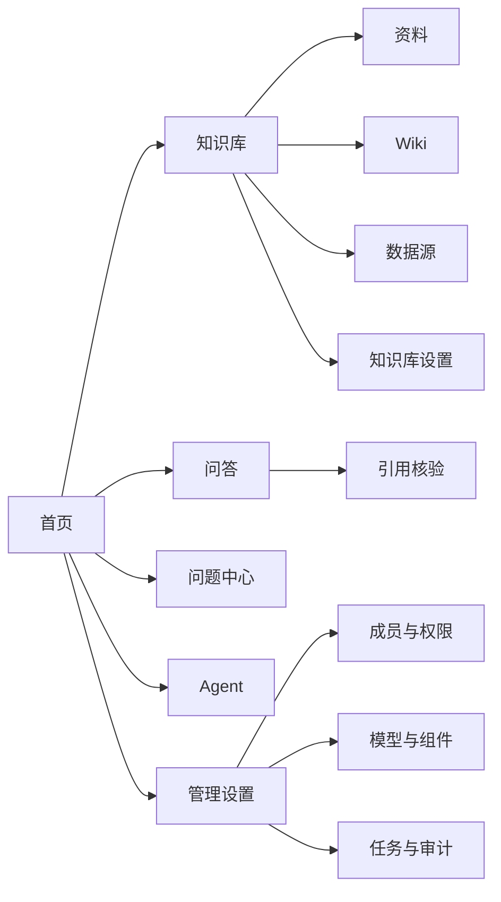

# LoreLattice V1.0 产品需求文档（PRD｜面试展示版）

> 文档版本：1.0  
> 文档日期：2026-08-20  
> 文档阶段：需求评审 / 开发前  
> 目标版本：LoreLattice V1.0  
> 产品负责人：产品经理  
> 主要读者：产品、设计、前端、后端、AI/算法、测试、运维  

---

## 0. 文档说明

### 0.1 文档目的

本 PRD 用于产品完成立项后、进入设计与研发前，明确 LoreLattice V1.0 的产品范围、页面结构、用户流程、功能规则、状态异常、权限、数据、埋点和验收标准。

本文不重复论证市场机会、竞品格局和商业模式。相关结论分别见：

- `LoreLattice_PRODUCT_ANALYSIS_INTERVIEW.md`；
- `LoreLattice_PRODUCT_INITIATION_PRD_INTERVIEW.md`。

### 0.2 输入结论

V1.0 接受以下已经通过立项评审的产品决策：

1. 产品定位为自托管 AI 知识工作平台；
2. 首要价值是让用户完成有来源、可核验的知识任务；
3. 核心闭环为“资料导入—知识加工—带引用问答—原文核验—问题反馈”；
4. V1.0 不建设通用低代码 Workflow、自研基础模型和复杂商业计费；
5. 产品必须支持工作空间权限、模型可替换和自托管部署。

### 0.3 需求优先级

| 优先级 | 定义 | 发布规则 |
|---|---|---|
| P0 | 核心路径或安全阻断项 | 未完成不得发布 V1.0 |
| P1 | 完整体验和主要差异化能力 | 应进入 V1.0；必要时经评审降级 |
| P2 | 增强能力 | 不阻断发布，可进入后续小版本 |

### 0.4 需求状态

| 状态 | 含义 |
|---|---|
| Draft | 产品正在补充或调整 |
| Ready | 产品、设计、研发和测试已完成评审 |
| In Development | 已进入研发 |
| Accepted | 已通过验收 |
| Deferred | 推迟到后续版本 |

---

## 1. V1.0 产品定义

### 1.1 产品目标

LoreLattice V1.0 需要让一个新团队完成以下完整任务：

> 管理员完成最小配置，知识负责人导入资料，成员基于指定知识库获得带引用答案，并能从答案回到原文、提交问题和推动知识修订。

### 1.2 版本成功条件

1. 新用户不依赖研发人员即可完成工作空间与模型配置；
2. 用户能够看到资料从上传到可检索的每个处理阶段；
3. 知识库回答必须提供可打开的引用，证据不足时不得伪造引用；
4. 回答问题能够进入问题队列，并保留处理历史；
5. Viewer、Contributor、Admin、Owner 的权限在前后端一致；
6. 产品具备安装、健康检查、备份和回滚说明。

### 1.3 V1.0 范围

| 模块 | V1.0 范围 | 优先级 |
|---|---|---:|
| 身份与工作空间 | 登录、首次引导、空间切换、成员角色 | P0 |
| 模型配置 | 对话、Embedding、Rerank 的连接测试和启停 | P0 |
| 知识库 | 创建、编辑、权限、列表与详情 | P0 |
| 资料加工 | 上传、解析、分块、索引、失败恢复 | P0 |
| 检索问答 | 知识范围、多轮对话、检索与流式回答 | P0 |
| 引用核验 | 引用列表、原文上下文与文档定位 | P0 |
| 问题中心 | 反馈、认领、处理、复测和关闭 | P0 |
| Wiki | 生成目录、查看页面、来源引用 | P1 |
| Agent | 快速问答、研究模式和授权工具 | P1 |
| 数据源 | 手动创建、同步与日志 | P1 |
| 管理与审计 | 成员、系统状态、失败任务、审计日志 | P0 |

### 1.4 不在 V1.0 范围

- 通用拖拽式 Workflow 编排器；
- Agent 模板市场；
- 自研模型训练平台；
- 商业套餐、在线支付和复杂额度结算；
- 原生移动端；
- 跨地域多活、复杂审批和客户定制组织架构。

---

## 2. 用户角色与权限

### 2.1 角色定义

| 角色 | 使用目标 | 默认能力 |
|---|---|---|
| Viewer | 查询、阅读和反馈 | 查看授权知识库、提问、打开引用、提交反馈 |
| Contributor | 创建和维护自己的知识 | Viewer 能力 + 创建知识库、上传资料、处理授权问题 |
| Admin | 管理整个工作空间 | 管理全部资源、成员、模型、数据源、系统配置和审计 |
| Owner | 对空间承担最终责任 | Admin 能力 + 转移所有权、删除工作空间 |

### 2.2 权限矩阵

| 操作 | Viewer | Contributor | Admin | Owner |
|---|:---:|:---:|:---:|:---:|
| 查看授权知识库 | ✓ | ✓ | ✓ | ✓ |
| 使用问答、Wiki 和授权 Agent | ✓ | ✓ | ✓ | ✓ |
| 提交回答反馈 | ✓ | ✓ | ✓ | ✓ |
| 创建知识库 |  | ✓ | ✓ | ✓ |
| 编辑自己创建的知识库 |  | ✓ | ✓ | ✓ |
| 编辑他人知识库 |  |  | ✓ | ✓ |
| 删除自己创建的知识库 |  | ✓ | ✓ | ✓ |
| 管理成员 |  |  | ✓ | ✓ |
| 配置模型和系统组件 |  |  | ✓ | ✓ |
| 查看审计与失败任务 |  |  | ✓ | ✓ |
| 删除空间或转移所有权 |  |  |  | ✓ |

### 2.3 权限规则

1. 所有写操作必须由服务端鉴权；前端隐藏按钮只用于改善体验；
2. Contributor 对自己创建的知识库拥有编辑权限，对他人资源默认只读；
3. 用户通过链接进入无权资源时，显示无权限页，不泄漏资源名称和内容；
4. 角色变更即时生效，当前页面下一次请求必须使用新权限；
5. 每个工作空间始终保留且仅保留一名 Owner；
6. 删除、角色变更、密钥和系统配置操作必须写入审计日志。

---

## 3. 信息架构与导航



### 3.1 一级导航

| 导航 | 展示条件 | 默认落地页 |
|---|---|---|
| 首页 | 所有角色 | 最近知识库、最近对话、待处理问题、首次任务 |
| 知识库 | 所有角色 | 用户有权访问的知识库列表 |
| 问答 | 所有角色 | 新建对话或最近一次对话 |
| 问题中心 | 所有角色 | 与用户权限相关的问题列表 |
| Agent | 所有角色 | 可运行的预置和自定义 Agent |
| 管理设置 | Admin、Owner | 工作空间概览 |

### 3.2 知识库二级导航

| 页签 | 功能 | 优先级 |
|---|---|---:|
| 概览 | 资料数量、可用状态、最近活动、快捷操作 | P0 |
| 资料 | 文件、FAQ、处理状态和批量操作 | P0 |
| Wiki | 目录、页面和来源 | P1 |
| 数据源 | 外部来源、同步和日志 | P1 |
| 检索测试 | 查询、召回片段、分数和调参入口 | P1 |
| 设置 | 基础信息、模型、分块、索引、权限和删除 | P0 |

---

## 4. 全局交互规范

### 4.1 页面状态

每个列表和详情页面必须覆盖：

- 首次空状态；
- 加载状态；
- 正常状态；
- 部分失败状态；
- 全量失败状态；
- 无权限状态；
- 无搜索结果状态。

### 4.2 全局反馈

| 类型 | 使用场景 | 展示规则 |
|---|---|---|
| Toast | 保存成功、复制成功等轻量结果 | 3 秒后自动消失，不承载关键失败原因 |
| Inline Alert | 当前模块可恢复错误 | 固定在相关表单或内容上方 |
| Dialog | 删除、角色变更、密钥替换等高风险操作 | 明确对象、影响和不可逆部分 |
| Error Page | 页面级加载失败、无权限或资源不存在 | 提供返回、安全的重试或联系管理员入口 |
| Task Panel | 文档处理、Wiki 生成、数据同步等异步任务 | 可离开页面，返回后继续查看状态 |

### 4.3 表单规则

1. 必填项使用文字与标识共同提示；
2. 输入错误在字段下方展示，不只使用 Toast；
3. 保存按钮在请求期间防重复提交；
4. 离开有未保存内容的页面时弹出确认；
5. 密钥保存后只展示脱敏值，重新编辑需要重新输入；
6. 高级参数默认折叠，并提供默认值、范围和影响说明。

### 4.4 时间与状态

- 列表优先展示相对时间，悬停展示完整时间；
- 所有异步任务展示创建时间、最近更新时间和完成时间；
- 状态不能只依赖颜色，必须同时显示文字或图标；
- 已取消、已失败和已删除对象不得继续显示“处理中”。

---

## 5. 核心用户流程

### 5.1 首次使用流程


完成条件：用户打开至少一个引用，系统记录首个可信知识任务。

### 5.2 资料处理流程

```text
本地选择 → 上传校验 → 文件入库 → 解析 → 分块 → 向量化 → 建立索引 → 可用
```

任何阶段失败均必须保留已知状态，并提供重试、删除或查看原因。

### 5.3 问答与核验流程

```text
选择知识范围 → 输入问题 → 检索 → 重排 → 流式生成 → 展示引用 → 打开原文 → 继续追问/提交反馈
```

### 5.4 问题处理流程

```text
提交反馈 → 待处理 → 已认领 → 处理中 → 待复测 → 已关闭
                                  ↘ 无需处理
```

关闭前必须保留处理备注；重新发现问题时允许恢复为“待处理”。

---

## 6. 登录、工作空间与首次引导

### 6.1 登录页

| ID | 需求 | 优先级 | 验收标准 |
|---|---|---:|---|
| AUTH-001 | 用户通过受支持的认证方式登录 | P0 | 成功进入上次工作空间；失败不区分账号是否存在 |
| AUTH-002 | 登录后恢复安全的原访问地址 | P1 | 只允许站内地址，防止开放重定向 |
| AUTH-003 | 会话过期后跳转登录并保留未提交问题草稿 | P1 | 重新登录后可恢复草稿，不恢复密钥字段 |

### 6.2 工作空间引导页

页面结构：

1. 产品价值说明；
2. “创建工作空间”和“加入已有空间”两个入口；
3. 创建表单：空间名称；
4. 创建成功后进入四步首次任务。

| ID | 需求 | 优先级 | 验收标准 |
|---|---|---:|---|
| ONB-001 | 用户可创建工作空间 | P0 | 名称 2–40 字符；创建者成为 Owner |
| ONB-002 | 首页展示首次任务进度 | P0 | 模型、知识库、资料、问答四步分别记录状态 |
| ONB-003 | 用户可以暂时关闭引导 | P1 | 首页保留恢复入口；完成后不再自动弹出 |
| ONB-004 | 系统根据角色调整任务 | P0 | Viewer 不显示模型和创建知识库任务 |

### 6.3 空间切换

1. 顶部空间选择器显示当前空间；
2. 列表只展示当前用户有权访问的空间；
3. 切换后清除当前知识库与对话筛选；
4. 不跨空间复用未发送问题、密钥或上传队列；
5. 目标空间不可用时回到上一个可用空间。

---

## 7. 模型配置

### 7.1 页面结构

模型设置按职责分为：

- 对话模型；
- Embedding；
- Rerank；
- 视觉理解；
- 语音识别。

V1.0 首次任务只要求完成对话模型和 Embedding；Rerank 为推荐配置，其他能力按资料类型提示。

### 7.2 配置列表

| 字段 | 说明 |
|---|---|
| 名称 | 空间内唯一，便于识别用途 |
| 职责 | Chat / Embedding / Rerank / VLM / ASR |
| 提供方 | 兼容的模型服务类型 |
| 模型名 | 实际调用模型标识 |
| 状态 | 未测试 / 可用 / 不可用 / 已停用 |
| 最近测试 | 时间、延迟分桶和结果 |

### 7.3 功能需求

| ID | 需求 | 优先级 | 验收标准 |
|---|---|---:|---|
| MOD-001 | Admin 可新增模型配置 | P0 | 保存前完成字段校验；密钥不回显 |
| MOD-002 | Admin 可执行连接测试 | P0 | 返回成功、鉴权失败、模型不存在、超时等可理解结果 |
| MOD-003 | Admin 可设为默认配置 | P0 | 每类职责最多一个默认；替换需确认影响 |
| MOD-004 | Admin 可停用配置 | P0 | 被知识库使用时展示影响范围并阻止直接删除 |
| MOD-005 | 系统展示职责说明和推荐组合 | P1 | 用户能判断当前缺少什么，不要求理解全部模型参数 |
| MOD-006 | 修改密钥不会清空其他字段 | P0 | 保存失败时继续使用旧的有效密钥 |

### 7.4 业务规则

1. 未完成最小模型配置时，不允许创建需要索引的知识库；
2. 连接测试不得把完整密钥写入日志或响应；
3. Embedding 模型更换后，已有知识库必须明确提示是否需要重建索引；
4. 默认模型不可直接删除，必须先指定替代配置；
5. 普通成员只能查看模型是否可用，不能查看端点和密钥。

---

## 8. 知识库列表与创建

### 8.1 知识库列表

页面元素：

- 创建知识库按钮；
- 搜索框；
- 标签和可见范围筛选；
- 卡片/列表视图切换；
- 名称、描述、资料数、状态、创建者和更新时间；
- 最近打开知识库优先入口。

### 8.2 列表状态

| 状态 | 展示内容 | 用户操作 |
|---|---|---|
| 无知识库 | 价值说明、创建按钮、示例结构 | 创建或加入授权知识库 |
| 有知识库 | 列表、搜索和筛选 | 打开、编辑、复制链接 |
| 无搜索结果 | 当前关键词和清空筛选 | 修改关键词或清空 |
| 加载失败 | 简短原因和重试 | 重试，不清空搜索条件 |

### 8.3 创建知识库

| 字段 | 必填 | 规则 | 默认值 |
|---|:---:|---|---|
| 名称 | 是 | 2–60 字符；空间内允许重名但应提示 | 无 |
| 描述 | 否 | 最多 300 字符 | 空 |
| 类型 | 是 | 文档知识库 / FAQ / Wiki 增强 | 文档知识库 |
| 可见范围 | 是 | 私有 / 工作空间可见 | 私有 |
| 默认模型 | 是 | 使用空间默认或选择其他可用配置 | 空间默认 |
| 分块策略 | 是 | 自动 / 标题 / 启发式 / 递归 | 自动 |

### 8.4 功能需求

| ID | 需求 | 优先级 | 验收标准 |
|---|---|---:|---|
| KB-001 | 用户可搜索和筛选有权访问的知识库 | P0 | 搜索名称和描述；筛选可叠加并可清空 |
| KB-002 | Contributor 以上可创建知识库 | P0 | 创建成功进入概览；创建者记录正确 |
| KB-003 | 创建时检查模型和索引前置条件 | P0 | 缺少配置时定位到对应设置，不创建半成品 |
| KB-004 | 创建者或 Admin 可编辑基础信息 | P0 | 保存后列表与详情同步更新 |
| KB-005 | 删除知识库需要输入名称确认 | P0 | 明确资料、索引、Wiki 和对话引用的影响 |
| KB-006 | Viewer 无法看到编辑和删除入口 | P0 | 直接调用接口同样返回无权限 |

---

## 9. 知识库概览与设置

### 9.1 概览页

概览页展示：

- 可用资料数、处理中、失败数；
- 最近一次成功索引时间；
- 最近提问与问题数量；
- 快捷操作：上传资料、开始提问、检索测试；
- 最近活动；
- 阻断性配置告警。

### 9.2 设置分组

| 设置组 | 内容 | 权限 |
|---|---|---|
| 基础信息 | 名称、描述、图标、标签 | 创建者或 Admin |
| 模型 | Chat、Embedding、Rerank | Admin；创建者可选择已授权配置 |
| 分块 | 策略、大小、重叠、父子分块 | 创建者或 Admin |
| 索引 | 关键词、向量、混合检索参数 | 创建者或 Admin |
| 权限 | 可见范围、共享成员 | 创建者或 Admin |
| 高级 | 数据源、存储、图谱、活动记录 | 按功能授权 |
| 危险操作 | 清空索引、重建、删除知识库 | 创建者或 Admin |

### 9.3 设置变更规则

1. 只影响新资料的设置必须标注“仅对后续资料生效”；
2. 需要重建索引的设置必须展示受影响资料数和预计影响；
3. 用户确认重建后先创建后台任务，不阻塞页面；
4. 重建失败时保留上一个可用索引；
5. 多人同时编辑时，后提交者收到版本冲突提示，不静默覆盖。

---

## 10. 资料上传与处理

### 10.1 上传入口

用户可通过以下入口上传：

- 资料页“上传”按钮；
- 拖拽文件到资料页；
- 首页首次任务；
- 数据源同步。

### 10.2 上传前校验

| 校验项 | 规则 |
|---|---|
| 权限 | Viewer 不可上传 |
| 格式 | V1.0 支持 PDF、DOCX、Markdown、TXT；其他格式明确提示 |
| 文件大小 | 使用部署配置上限；界面展示当前限制 |
| 重复文件 | 按文件名、大小和内容摘要提示可能重复 |
| 空文件/加密文件 | 上传前或解析阶段识别并给出处理建议 |
| 剩余能力 | 缺少解析或模型配置时阻止进入不可完成状态 |

### 10.3 上传确认

确认弹窗展示：

- 文件列表、大小和格式；
- 目标知识库；
- 分块策略摘要；
- 重复文件提醒；
- “开始处理”与“返回调整”。

### 10.4 文档状态机

```text
待上传 → 上传中 → 等待处理 → 解析中 → 分块中 → 索引中 → 可用
            ↓          ↓          ↓         ↓         ↓
          已取消      失败       失败      失败      失败
```

### 10.5 功能需求

| ID | 需求 | 优先级 | 验收标准 |
|---|---|---:|---|
| DOC-001 | 用户可批量选择或拖拽文件 | P0 | 单次选择多个文件；逐文件展示校验结果 |
| DOC-002 | 上传队列逐文件展示进度 | P0 | 单文件失败不影响其他文件；可取消未完成上传 |
| DOC-003 | 处理状态按阶段展示 | P0 | 至少区分解析、分块、索引和可用 |
| DOC-004 | 失败资料展示可操作的错误原因 | P0 | 提供重试、删除或查看配置入口 |
| DOC-005 | 用户可预览原文和分块 | P0 | 可按分块查看文本、位置和元数据 |
| DOC-006 | 用户可批量重试或删除 | P1 | 只处理选中对象；结果逐项返回 |
| DOC-007 | 删除文档同步清理有效索引 | P0 | 删除完成后不再被新问题召回 |
| DOC-008 | 文档更新可保留版本信息 | P1 | 新版本可处理；旧版本不继续参与默认检索 |

### 10.6 错误文案要求

错误必须包含：

- 失败阶段；
- 对当前资料的影响；
- 可执行的下一步；
- 错误标识，供管理员在任务中心检索。

不得只展示“处理失败”或内部堆栈。

---

## 11. 分块、索引与检索测试

### 11.1 分块设置

| 设置 | 默认 | 交互规则 |
|---|---:|---|
| 策略 | 自动 | 推荐；根据资料结构选择处理方式 |
| 分块大小 | 512 字符 | 限制在部署支持范围内 |
| 重叠 | 80 字符 | 不得大于分块大小 |
| 父子分块 | 长文档建议开启 | 开启后显示父、子块大小 |
| Token 上限 | 关闭 | 仅小上下文 Embedding 模型需要 |

### 11.2 调试预览

用户上传一段示例文本后，可以查看：

- 识别到的文档结构；
- 分块数量；
- 每个分块的边界；
- 上下文标题；
- 过短、过长或异常分块提醒。

### 11.3 检索测试

| ID | 需求 | 优先级 | 验收标准 |
|---|---|---:|---|
| RET-001 | 用户可输入测试问题查看召回片段 | P1 | 展示片段、文档、位置、检索方式和排序 |
| RET-002 | 用户可调整 Top K 与阈值后重新测试 | P1 | 不直接保存；点击应用后才更新设置 |
| RET-003 | 混合检索区分关键词与向量结果 | P1 | 合并后仍能查看来源方式 |
| RET-004 | 无结果时提供调试建议 | P1 | 提示资料状态、知识范围、阈值和问题表达 |
| RET-005 | 保存需要重建的参数时明确提示 | P0 | 未确认不启动任务；旧索引继续可用 |

---

## 12. 问答页面

### 12.1 页面结构

| 区域 | 内容 |
|---|---|
| 左侧会话栏 | 新建会话、历史会话、搜索、重命名、删除 |
| 顶部范围栏 | 当前工作空间、知识库范围、问答/研究模式 |
| 消息区 | 用户问题、回答、处理状态、引用、工具结果 |
| 输入区 | 多行输入、发送、停止、附件入口和快捷建议 |
| 右侧抽屉 | 引用详情、原文上下文和文档信息 |

### 12.2 新建会话

1. 默认继承最近使用的知识库；
2. 没有可用知识库时显示创建或选择入口；
3. 用户可选择一个或多个授权知识库；
4. 选择范围变化只影响后续问题；
5. 会话标题在首个问题完成后自动生成，用户可修改。

### 12.3 发送与生成状态

```text
草稿 → 已发送 → 检索中 → 生成中 → 已完成
                        ↘ 已停止
                        ↘ 失败
```

| ID | 需求 | 优先级 | 验收标准 |
|---|---|---:|---|
| CHAT-001 | 用户可输入问题并发送 | P0 | 空问题不可发送；请求期间防重复提交 |
| CHAT-002 | 系统展示检索和生成阶段 | P0 | 用户能区分仍在检索还是正在输出 |
| CHAT-003 | 回答使用流式输出 | P0 | 中断后保留已生成内容和状态 |
| CHAT-004 | 用户可停止生成 | P0 | 停止后不继续追加正文；引用按已完成结果处理 |
| CHAT-005 | 失败后可一键重试 | P0 | 保留原问题和知识范围；新回答单独记录 |
| CHAT-006 | 支持多轮对话 | P0 | 每轮回答有独立引用；可清除或新建上下文 |
| CHAT-007 | 用户可复制回答 | P0 | 默认复制回答正文；可选择同时复制引用 |
| CHAT-008 | 用户可编辑并重新发送自己的问题 | P1 | 从编辑点创建新分支，不静默改写历史 |
| CHAT-009 | 历史会话可搜索、重命名和删除 | P1 | 删除二次确认；其他空间不可见 |

### 12.4 证据不足回答

当检索结果不足以支持回答时，系统应：

1. 明确说明没有足够证据；
2. 展示当前检索的知识范围；
3. 不生成虚构引用；
4. 提供“调整范围”“上传资料”“改写问题”入口；
5. 允许用户把该问题标记为“知识缺口”。

---

## 13. 引用与原文核验

### 13.1 回答内引用

- 引用标记放在对应结论之后；
- 同一片段重复引用使用相同编号；
- 回答底部汇总本轮全部引用；
- 引用数量为零时不展示空的引用区域；
- 引用失效时标注原因，不跳转空白页。

### 13.2 引用抽屉

| 字段 | 内容 |
|---|---|
| 文档 | 文件名、类型、版本、更新时间 |
| 命中片段 | 实际提供给回答的文本 |
| 原文上下文 | 命中片段前后文 |
| 位置 | 页码、章节或分块位置，按资料能力展示 |
| 操作 | 打开文档、复制片段、提交问题 |

### 13.3 功能需求

| ID | 需求 | 优先级 | 验收标准 |
|---|---|---:|---|
| CIT-001 | 用户点击引用打开右侧抽屉 | P0 | 保持对话滚动位置；抽屉加载失败可重试 |
| CIT-002 | 抽屉展示命中片段与上下文 | P0 | 命中内容高亮；不存在上下文时不伪造 |
| CIT-003 | 用户可打开资料详情 | P0 | 有权限时定位原文；无权限时不泄漏内容 |
| CIT-004 | 引用记录关联回答和文档版本 | P0 | 文档更新后历史回答仍显示当时版本信息 |
| CIT-005 | 用户可对具体引用提交问题 | P1 | 问题自动带入回答、文档和片段关联 |

---

## 14. 回答反馈与问题中心

### 14.1 反馈入口

回答工具栏提供：

- 有帮助；
- 无帮助；
- 错误；
- 已过期；
- 证据不足；
- 引用无关；
- 知识缺口。

“有帮助/无帮助”可单击完成；问题类反馈需要选择原因，可选填说明。

### 14.2 问题列表

| 字段 | 内容 |
|---|---|
| 问题摘要 | 类型 + 问题文本摘要 |
| 关联对象 | 知识库、回答、引用或文档 |
| 状态 | 待处理、已认领、处理中、待复测、已关闭、无需处理 |
| 负责人 | 当前认领人 |
| 提交人 | 用户及角色 |
| 时间 | 创建、最近更新和处理时长 |

### 14.3 问题详情

详情页或抽屉包含：

- 原问题和回答快照；
- 相关引用；
- 提交原因与说明；
- 状态和负责人；
- 处理记录；
- 跳转资料；
- 使用原问题重新测试；
- 关闭或恢复。

### 14.4 功能需求

| ID | 需求 | 优先级 | 验收标准 |
|---|---|---:|---|
| ISS-001 | 用户可提交回答或引用问题 | P0 | 关联对象完整；重复点击不创建重复记录 |
| ISS-002 | 用户可查看自己提交的问题 | P0 | 状态和处理备注可见；敏感内部备注不展示 |
| ISS-003 | 负责人可筛选、认领和处理授权问题 | P0 | 状态流转符合规则；操作进入历史 |
| ISS-004 | 问题可关联资料修订动作 | P1 | 能跳转资料或 Wiki 页面，不自动修改原文 |
| ISS-005 | 处理后可使用原问题复测 | P0 | 新结果与旧结果分开保存；通过后才能关闭 |
| ISS-006 | 已关闭问题可重新打开 | P1 | 记录重新打开原因和操作者 |

### 14.5 状态规则

1. 只有待处理问题可以直接认领；
2. 非负责人不能把问题从“处理中”直接关闭，Admin 除外；
3. 关闭需要填写处理结论；
4. “无需处理”需要选择原因；
5. 文档被删除不删除问题历史，但关联内容改为不可用；
6. 问题状态变化产生通知事件，V1.0 可只在站内展示。

---

## 15. Wiki

### 15.1 功能范围

Wiki 用于把知识库资料组织成可浏览的目录和页面，但不替代原始资料。V1.0 提供生成、浏览、来源核验和有限编辑。

### 15.2 页面结构

| 区域 | 内容 |
|---|---|
| 左侧目录 | 文件夹、页面、搜索和展开状态 |
| 主内容 | 标题、正文、来源、更新时间 |
| 右侧信息 | 关联页面、来源文档、问题入口 |
| 顶部操作 | 重新生成、编辑、查看历史 |

### 15.3 功能需求

| ID | 需求 | 优先级 | 验收标准 |
|---|---|---:|---|
| WIKI-001 | 负责人可从知识库生成 Wiki | P1 | 创建异步任务；展示范围和状态 |
| WIKI-002 | 用户可浏览目录与页面 | P1 | 展开状态保持；无权页面不展示 |
| WIKI-003 | 页面关键内容带来源 | P1 | 点击来源打开原文上下文 |
| WIKI-004 | 授权用户可编辑页面 | P1 | 保留修改人和时间；不改写原始资料 |
| WIKI-005 | 用户可标记页面问题 | P1 | 进入统一问题中心，类型为 Wiki 问题 |
| WIKI-006 | 重新生成前展示覆盖影响 | P1 | 手工修改内容不被静默覆盖 |

---

## 16. Agent

### 16.1 V1.0 Agent 类型

| 类型 | 主要任务 | 默认知识范围 | 默认工具 |
|---|---|---|---|
| 快速问答 | 单轮或短多轮知识问答 | 用户选择的知识库 | 知识检索 |
| 研究模式 | 多步骤查证和归纳 | 用户选择的知识库 | 知识检索、文档读取 |
| Wiki 问答 | 跨 Wiki 页面导航并回到原文 | Wiki 知识库 | Wiki 搜索、页面读取、原文读取 |

### 16.2 Agent 列表

- 展示名称、描述、类型、可用知识库和创建者；
- 内置 Agent 与自定义 Agent 使用不同标识；
- 用户只看到自己有权运行的 Agent；
- Admin 可停用自定义 Agent；
- V1.0 不提供模板市场。

### 16.3 功能需求

| ID | 需求 | 优先级 | 验收标准 |
|---|---|---:|---|
| AGT-001 | 用户可直接运行内置 Agent | P1 | 无需配置 Prompt；缺少知识库时引导选择 |
| AGT-002 | Contributor 可创建自定义 Agent | P1 | 必须选择类型、知识范围和可用工具 |
| AGT-003 | Agent 只能调用授权工具和知识库 | P0 | 越权调用被服务端拒绝并记录 |
| AGT-004 | 运行中展示步骤状态和工具结果摘要 | P1 | 不展示敏感内部推理；失败步骤可识别 |
| AGT-005 | 最终回答保留引用 | P0 | 使用知识内容时可回到原文 |
| AGT-006 | 用户可停止运行 | P1 | 停止后终止后续工具调用并保留已有结果 |

---

## 17. 数据源

### 17.1 数据源列表

字段包括名称、类型、目标知识库、状态、最近同步、下次计划和最近结果。

### 17.2 创建流程

```text
选择连接器 → 填写凭据 → 测试连接 → 选择资源 → 设置目标知识库 → 保存 → 手动首次同步
```

### 17.3 凭据规则

1. 测试连接时凭据只用于测试，不在失败响应中返回；
2. 保存成功后凭据只显示脱敏状态；
3. 编辑其他字段不要求重新输入凭据；
4. 更换凭据需要重新测试；
5. 删除数据源不默认删除已导入资料，必须让用户选择。

### 17.4 功能需求

| ID | 需求 | 优先级 | 验收标准 |
|---|---|---:|---|
| DS-001 | Admin 可创建支持的数据源 | P1 | 未通过连接测试不能保存启用状态 |
| DS-002 | 用户可选择外部资源和目标知识库 | P1 | 只展示有权资源；目标知识库可写 |
| DS-003 | 用户可手动触发同步 | P1 | 防重复任务；展示本次同步标识 |
| DS-004 | 同步日志逐项展示新增、更新、跳过和失败 | P1 | 失败条目有原因；成功条目可打开对应资料 |
| DS-005 | 用户可停用或删除数据源 | P1 | 停用不再同步；删除时选择是否保留资料 |

---

## 18. 成员与权限管理

### 18.1 成员列表

字段：姓名/标识、角色、状态、加入时间、最近活动和操作。

### 18.2 功能需求

| ID | 需求 | 优先级 | 验收标准 |
|---|---|---:|---|
| MEM-001 | Admin 可邀请成员 | P0 | 邀请记录包含角色和过期时间 |
| MEM-002 | Admin 可修改成员角色 | P0 | 不能移除唯一 Owner；变更立即生效 |
| MEM-003 | Admin 可停用或移除成员 | P0 | 停用后会话失效；保留审计记录 |
| MEM-004 | Owner 可转移所有权 | P0 | 双方确认；成功后原 Owner 变为 Admin |
| MEM-005 | 普通成员可查看自己的角色说明 | P1 | 不展示无权限的管理操作 |

### 18.3 移除成员的资源处理

移除前展示该成员创建的知识库和 Agent 数量。V1.0 采用：

- 资源保留在工作空间；
- 创建者字段保留历史标识；
- 资源管理权由 Admin 接管；
- 不因移除成员删除资料、对话或审计历史。

---

## 19. 管理后台、任务与审计

### 19.1 系统概览

Admin 可查看：

- API、数据库、缓存和文档解析服务状态；
- 当前版本；
- 最近失败任务；
- 模型配置可用性摘要；
- 存储与索引组件摘要。

### 19.2 任务中心

| 字段 | 内容 |
|---|---|
| 任务 | 类型、目标对象和任务标识 |
| 状态 | 排队、运行、成功、失败、已取消 |
| 进度 | 已处理/总量，无法计算时显示阶段 |
| 时间 | 创建、开始、更新和完成时间 |
| 诊断 | 失败阶段、错误标识、重试入口 |

| ID | 需求 | 优先级 | 验收标准 |
|---|---|---:|---|
| OPS-001 | Admin 可筛选和查看后台任务 | P0 | 按类型、状态、知识库和时间筛选 |
| OPS-002 | 可重试支持恢复的失败任务 | P0 | 重试生成新执行记录，保留原失败记录 |
| OPS-003 | 可取消仍支持取消的任务 | P1 | 取消后状态一致，不产生后续有效写入 |
| OPS-004 | 错误详情不包含密钥和完整敏感正文 | P0 | 日志展示脱敏上下文和错误标识 |

### 19.3 审计日志

记录范围：

- 成员邀请、角色修改、移除和所有权转移；
- 模型、存储、解析和数据源配置变更；
- 知识库、资料、Wiki 和 Agent 的删除；
- 密钥创建、撤销；
- 权限拒绝的关键管理请求。

审计字段：操作者、角色、动作、对象类型、对象标识、结果、时间和请求标识。

---

## 20. 状态、异常与恢复

### 20.1 通用错误分类

| 类型 | 示例 | 产品处理 |
|---|---|---|
| 用户输入错误 | 字段缺失、格式不支持 | 字段级提示，保留已输入内容 |
| 权限错误 | 无权访问或修改 | 无权限页/提示，不暴露对象内容 |
| 配置错误 | 模型不可用、缺少解析器 | 定位到配置项，保留当前任务 |
| 暂时性错误 | 超时、限流、网络故障 | 有限自动重试，允许人工重试 |
| 数据错误 | 文件损坏、索引不一致 | 隔离单个对象，提供修复或重建 |
| 系统错误 | 服务不可用 | 展示请求标识，记录诊断信息 |

### 20.2 重试规则

1. 只有幂等或具备幂等键的操作可以自动重试；
2. 鉴权失败、参数错误和不支持格式不得自动重试；
3. 指数退避达到上限后进入失败状态；
4. 人工重试产生新执行记录，但关联原任务；
5. 页面刷新不得创建重复上传、重复同步或重复回答。

### 20.3 删除规则

| 对象 | 删除前 | 删除后 |
|---|---|---|
| 会话 | 二次确认 | 从用户列表移除；保留必要审计 |
| 文档 | 展示引用和处理影响 | 不参与新检索；历史引用显示不可用状态 |
| 知识库 | 输入名称确认 | 资料、索引、Wiki 停止使用；审计保留 |
| 数据源 | 选择是否保留已导入资料 | 凭据删除；同步停止 |
| 工作空间 | 仅 Owner；强确认 | 进入删除任务；完成前不可重复操作 |

---

## 21. 核心数据对象

| 对象 | 必要字段 | 关键关系 |
|---|---|---|
| Workspace | id、name、owner、status、created_at | 包含成员、知识库和配置 |
| Member | user_id、workspace_id、role、status | 属于工作空间 |
| ModelConfig | type、provider、model、secret_ref、status | 属于工作空间 |
| KnowledgeBase | name、type、creator、visibility、status | 包含资料、Wiki、问题 |
| Document | name、source、version、processing_status | 属于知识库 |
| Chunk | document_id、content_ref、position、index_status | 属于资料 |
| Conversation | creator、workspace、knowledge_scope、status | 包含消息 |
| Message | role、content、status、created_at | 属于会话 |
| Citation | answer_id、document_version、chunk、position | 属于回答 |
| Issue | type、status、assignee、resolution | 关联回答、引用或页面 |
| WikiPage | title、content、revision、source_refs | 属于知识库 |
| Agent | type、knowledge_scope、tool_scope、creator | 属于工作空间 |
| DataSource | connector、credential_ref、target_kb、status | 产生同步任务 |
| Task | type、target、status、progress、error_code | 关联后台处理 |
| AuditEvent | actor、action、object、result、timestamp | 属于工作空间 |

### 21.1 数据一致性规则

1. Citation 必须保存当时使用的文档版本，不能只指向当前版本；
2. 文档状态为“可用”前，不得参与默认检索；
3. 删除索引与更新文档状态必须保持一致；
4. 问题历史不因关联内容删除而消失；
5. 任务状态只能按合法状态机转换；
6. 跨工作空间对象不得建立可访问引用。

---

## 22. 埋点与产品数据

### 22.1 核心事件

| 事件 | 触发条件 | 关键属性 |
|---|---|---|
| `onboarding_step_completed` | 首次任务单步完成 | step、role、duration_bucket |
| `model_connection_tested` | 连接测试结束 | model_type、provider、result、latency_bucket |
| `knowledge_base_created` | 创建成功 | type、visibility、chunking_strategy |
| `document_upload_completed` | 文件上传结束 | format、size_bucket、result |
| `document_processing_completed` | 文档到达最终状态 | result、failure_stage、duration_bucket |
| `question_submitted` | 问题成功发送 | kb_count、mode、conversation_turn |
| `answer_completed` | 回答到达最终状态 | result、citation_count、duration_bucket |
| `citation_opened` | 用户打开引用 | citation_rank、document_type |
| `answer_feedback_submitted` | 用户完成反馈 | type、has_comment |
| `issue_status_changed` | 问题状态变化 | from、to、actor_role |
| `verified_task_completed` | 问题、回答、引用核验闭环完成 | time_to_value、verification_action |

### 22.2 埋点规则

- 不采集文档正文、完整问题、完整回答和密钥；
- workspace_id、knowledge_base_id 等标识在分析侧使用安全映射；
- 失败事件必须包含阶段和稳定错误码；
- 同一业务动作前后端重复上报时只保留一个主事件；
- 首次任务时间从工作空间可用开始，到首个引用打开结束。

### 22.3 看板需求

V1.0 需要内部产品看板展示：

- 首次任务漏斗；
- 文档处理成功率和失败阶段；
- 问答完成率、引用覆盖和引用打开；
- 问题提交、处理时长和关闭率；
- 工作空间周度可信知识任务数；
- 核心错误与延迟分布。

---

## 23. 非功能需求

### 23.1 性能

| 指标 | V1.0 验收目标 |
|---|---:|
| 普通页面 API P95 | ≤ 500 ms |
| 知识检索 P95 | ≤ 1.5 s |
| 回答开始输出 P95 | ≤ 5 s，外部模型正常条件下 |
| 文档状态页面刷新延迟 | ≤ 5 s |
| 关键列表首屏 | 2,000 条规模下可分页使用 |

### 23.2 安全

- 所有业务数据按工作空间隔离；
- 密钥只存储安全引用或加密值；
- 日志、错误和埋点不包含完整敏感内容；
- 上传文件必须校验类型、大小和安全策略；
- 外部工具和网络搜索默认关闭，由 Admin 启用；
- API Key 可创建、查看一次、撤销和审计。

### 23.3 可靠性

- 核心 API 在 Pilot 目标可用性为 99.5%；
- 异步任务支持幂等、超时、有限重试和状态恢复；
- 单个文档或数据源失败不影响其他知识库；
- 配置更新失败保留上一份有效配置；
- 数据库和文件具备备份及恢复说明。

### 23.4 兼容性与可访问性

- 支持当前主流 Chrome、Edge 和 Safari；
- 核心操作支持键盘导航；
- 交互状态不只用颜色表达；
- 界面文本支持国际化结构；
- 长文本、中文文件名和混合语言文档不破坏布局。

### 23.5 可观测性

- 请求、后台任务和外部模型调用具备关联标识；
- 关键模块提供健康检查；
- 管理员可以定位失败阶段，但看不到其他空间内容；
- 指标区分业务失败、用户取消和系统错误。

---

## 24. 验收测试

### 24.1 核心路径验收

| ID | 场景 | 前置条件 | 验收结果 |
|---|---|---|---|
| AC-001 | 首次创建空间 | 新用户 | 创建成功，用户为 Owner，进入首次任务 |
| AC-002 | 完成最小模型配置 | Admin，有有效服务 | Chat 与 Embedding 测试成功，引导状态更新 |
| AC-003 | 创建知识库 | Contributor 以上 | 创建成功，权限和默认配置正确 |
| AC-004 | 批量上传资料 | 3 个支持格式文件 | 独立显示状态，全部进入可用或明确失败 |
| AC-005 | 失败恢复 | 一份损坏文件 | 用户看到失败阶段，可重试或删除 |
| AC-006 | 提交知识问题 | 有可用资料 | 回答完成并展示至少一个可打开引用 |
| AC-007 | 核验原文 | 有引用回答 | 引用抽屉展示片段和上下文，可打开资料 |
| AC-008 | 证据不足 | 知识库无相关内容 | 系统明确证据不足，不生成伪引用 |
| AC-009 | 提交问题 | 已完成回答 | 问题记录关联回答、引用和提交人 |
| AC-010 | 问题处理闭环 | 有待处理问题 | 认领、处理、复测和关闭均有历史 |
| AC-011 | Viewer 权限 | Viewer 登录 | 可提问，不可上传、配置或修改资源 |
| AC-012 | Contributor 归属 | 两名 Contributor | 不能修改对方知识库 |
| AC-013 | 模型更换 | 默认模型正在使用 | 展示影响，不允许无替代删除 |
| AC-014 | 文档删除 | 文档有历史引用 | 新问题不再召回；历史引用显示不可用 |
| AC-015 | 数据源同步 | 有有效连接器 | 日志区分新增、更新、跳过和失败 |
| AC-016 | Agent 越权 | Agent 绑定未授权资源 | 服务端拒绝调用并记录审计 |

### 24.2 发布阻断项

以下任一失败不得发布：

- 跨工作空间读取或修改数据；
- 密钥明文出现在页面、日志或 API 响应；
- 删除资料后仍能被新问题召回；
- 回答引用无法打开或指向错误文档；
- 文档任务失败后无状态、无原因且无法恢复；
- Viewer 可以执行写操作；
- 安装、备份或回滚流程未验证。

### 24.3 回归范围

每次涉及模型、检索、权限、文档状态或存储的变更，必须回归：

1. 首次任务；
2. 文档上传与处理；
3. 问答和引用；
4. 文档删除后的检索；
5. Viewer/Contributor/Admin/Owner 权限；
6. 后台任务与审计；
7. 升级和回滚。

---

## 25. 研发依赖与发布计划

### 25.1 依赖

| 依赖 | 产品要求 |
|---|---|
| 对话模型 | 支持流式输出、稳定错误和超时处理 |
| Embedding | 能返回向量并明确输入限制 |
| Rerank | 可选；未配置不阻断基础路径 |
| 文档解析 | 返回结构化文本、位置和稳定失败原因 |
| 向量存储 | 支持按工作空间与知识库过滤 |
| 任务系统 | 支持状态、幂等、重试和取消 |
| 文件存储 | 支持权限控制、删除和备份 |

### 25.2 开发拆分建议

| 迭代 | 主要范围 | 产品验收点 |
|---|---|---|
| Sprint 1 | 登录、空间、最小模型配置 | 新用户进入首次任务并通过连接测试 |
| Sprint 2 | 知识库、上传和任务状态 | 资料可进入可用状态，失败可定位 |
| Sprint 3 | 问答、流式输出和引用 | 完成一次带引用问答与原文核验 |
| Sprint 4 | 问题中心、权限和审计 | 完成反馈闭环与角色隔离 |
| Sprint 5 | Wiki、Agent、数据源与回归 | P1 能力可用，完成发布阻断测试 |

### 25.3 发布方式

1. 内部环境完成全量验收；
2. 固定版本进入 3–5 个试点空间；
3. Pilot 期间只修复阻断、质量和可用性问题；
4. 达到发布标准后生成 V1.0 发布候选；
5. 提供安装、升级、备份、回滚和已知限制。

---

## 26. 未决问题与变更控制

### 26.1 未决问题

| ID | 问题 | 决策时点 | 默认处理 |
|---|---|---|---|
| OQ-01 | V1.0 是否默认启用 Rerank | Sprint 2 前 | 推荐但不阻断 |
| OQ-02 | Wiki 手工编辑与重新生成如何合并 | Wiki 开发前 | 手工修改不被自动覆盖 |
| OQ-03 | 数据源删除是否默认保留资料 | 数据源评审 | 默认保留并让用户确认 |
| OQ-04 | 历史回答保留多长时间 | Pilot 前 | 由部署配置，界面明确说明 |
| OQ-05 | Agent 自定义 Prompt 对谁开放 | Agent 评审 | Contributor 可编辑自己创建的 Agent |

### 26.2 需求变更流程

1. 变更发起人描述问题、用户影响和证据；
2. 产品判断是否属于 V1.0 目标；
3. 研发评估工作量、依赖和风险；
4. 测试补充验收与回归范围；
5. P0 变更需产品、研发和测试共同确认；
6. 所有范围变化更新本文档版本记录，不在口头约定中生效。

### 26.3 变更判断模板

```text
问题：
受影响用户与场景：
当前行为：
期望行为：
是否阻断核心闭环：
是否存在替代方案：
工作量与风险：
结论：进入 V1.0 / 延后 / 拒绝
```

---

## 27. 需求评审清单

### 产品与设计

- [ ] 每个 P0 需求是否对应明确用户流程？
- [ ] 页面是否覆盖空、加载、成功、失败和无权限状态？
- [ ] 高风险操作是否展示对象和影响？
- [ ] 引用与问题反馈是否处于主流程？
- [ ] 高级配置是否渐进披露？

### 研发

- [ ] 每个异步任务是否有状态、幂等、重试和取消策略？
- [ ] 工作空间与资源权限是否由服务端校验？
- [ ] 引用是否关联具体文档版本？
- [ ] 删除和索引清理是否保持一致？
- [ ] 日志是否避免敏感内容？

### 测试

- [ ] 每个 P0 需求是否有可执行验收标准？
- [ ] 是否覆盖四种角色及资源归属？
- [ ] 是否覆盖模型、解析、网络和任务失败？
- [ ] 是否覆盖升级、备份与回滚？
- [ ] 是否完成发布阻断项测试？

---

## 28. 面试展示摘要

### 28.1 如何介绍这份 PRD

> 产品分析解决的是“为什么做”，立项文档解决的是“是否投入”，这份 V1.0 PRD 解决的是“开发前具体做什么、怎么工作、如何验收”。  
>  
> 我没有再次展开市场和竞品，而是把立项结论转成研发可执行的产品规格：先定义角色和信息架构，再把首次使用、资料加工、问答、引用和问题处理拆成页面、状态机、业务规则和异常。每个关键模块都有需求编号，并用权限、数据一致性、埋点、非功能和 16 个端到端验收场景把闭环收住。  
>  
> 这份文档的核心取舍是：V1.0 不追求通用 Workflow 和功能数量，而优先保证资料能被正确处理、回答能回到原文、错误能进入维护闭环，并且所有操作符合工作空间权限。

### 28.2 最值得展示的五个部分

1. **第 5 章核心流程**：证明需求来自端到端任务，而不是功能列表；
2. **第 10 章资料状态机**：体现对异步、失败和恢复的考虑；
3. **第 12–14 章问答、引用和问题闭环**：体现核心产品价值；
4. **第 20–21 章异常与数据一致性**：体现与研发协作的深度；
5. **第 24 章验收测试**：体现需求可验证，而不是只写“支持某功能”。

---

## 29. 参考输入

1. `docs/product/LoreLattice_PRODUCT_ANALYSIS_INTERVIEW.md`；
2. `docs/product/LoreLattice_PRODUCT_INITIATION_PRD_INTERVIEW.md`；
3. `README.md`；
4. `docs/RBAC说明.md`；
5. `docs/CHUNKING.md`；
6. `docs/数据源导入开发文档.md`；
7. `config/builtin_agents.yaml`；
8. `config/agent_type_presets.yaml`。

本文引用上述资料确定产品边界和需求输入，但所有 V1.0 条目均以本 PRD 的优先级、规则和验收标准为准。
